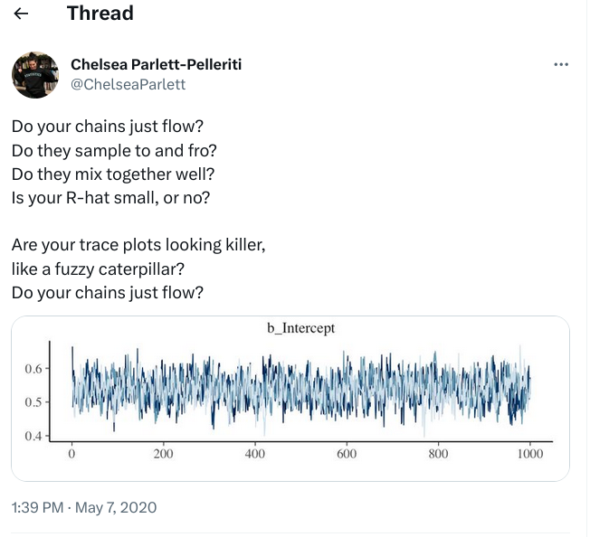

Includes material from Ian Dworkin and Jonathan Dushoff, but they bear no responsibility for the contents.


```{r setup, include=FALSE}
library(knitr)
library(pander)
library(emdbook)
```

# Introduction

## Why Bayes?

* magic black boxes for estimation ([BEAST](https://www.beast2.org/), [MrBayes](https://nbisweden.github.io/MrBayes/), [BayesTraits](http://www.evolution.reading.ac.uk/BayesTraitsV4.0.1/BayesTraitsV4.0.1.html), ...)
* build-your-own model [@mcelreathStatistical2020; @mccarthyBayesian2007; @clarkModels2020; @hobbsBayesian2015]
* better handling of uncertainty/error propagation [@elderdUncertainty2006a; @ludwigUncertainty1996]
* informative priors for data-poor decisions [@mccarthyProfiting2005]
* priors for regularization [@lemoineMoving2019]
* alternative inferential approach

## What do you need to know?

* basic meanings of output (point estimates, CIs)
* nuts and bolts of particular tools
* usually, more about probability distributions than you already knew
* for build-your-own, lots more about your model
* basics of Markov Chain Monte Carlo diagnostics

## Tools

- mixed models: `rstanarm`, `MCMCglmm`, `brms`, `INLA`
- build-your-own: toolboxes `BUGS` et al. (`JAGS`), `Stan`, `TMB`, `greta`, ...
- MCMC diagnostic tools

## Inference

```{r statstab, echo=FALSE, results = "asis"}
tab <- data.frame(Frequentist = c(
                      "null-hypothesis significance testing; AIC etc (every stats textbook; @burnhamModel2002)",
                      "MLE etc. + confidence intervals [@bolkerEcological2008a]"),
                  Bayesian = c("Bayes factors; Bayesian indices of significance [@makowskiIndices2019]",
                            "posterior means/medians and credible intervals"))
rownames(tab) <- c("Discrete hypothesis testing",
                   "Continuous/quantitative (estimation with uncertainty)")
knitr::kable(tab)
```


## Bayes Theorem 

* If $A_i$ are *alternative events* (exactly one must happen), then:

$$
\newcommand{\pr}{\textrm{Pr}}
\pr(A_i|B) = \frac{\pr(B|A_i) \pr(A_i)}{\sum \pr(B|A_j) \pr(A_j)}
$$

* $\pr(A_i)$ the *prior* probability of $A_i$
* $\pr(A_i|B)$ is the *posterior* probability of  $A_i$, given event $B$

* People argue about Bayesian inference, but nobody argues about Bayes
	 theorem

* Now let's change $A_i$ to $H_i$ ("hypothesis", which can denote a model *or* a particular parameter value) and $B$ to $D$ ("data"); we get 

$$
\begin{split}
	\pr(H_i|D) & = \frac{\pr(D|H_i) \pr(H_i)}{\sum \pr(D|H_j) \pr(H_j)} \\
	& = \frac{\pr(D|H_i) \pr(H_i)}{\pr(D)}
\end{split}
$$

If $D$ is the data, then $\pr(H_i)$ is the prior probability of hypothesis $H_i$ and $\pr(D|H_i)$ is the **likelihood** of hypothesis $H_i$.

The denominator is the probability of observing the data under *any* of the hypotheses. It looks scary, and it is computationally scary (when the $H_i$ represent a set of continuous parameter values, the sum becomes an integral; when a model has lots of continuous parameters, it becomes a high-dimensional integral). **However**, most tools for Bayesian inference represent elegant ways *to avoid ever having to compute the denominator explicitly*, so in practice you won't have to worry about it. You may sometimes see Bayes' Rule written out as $\textrm{posterior} \propto \textrm{likelihood} \times \textrm{prior}$, where $\propto$ means "proportional to", to emphasize that we can often avoid thinking about the denominator.

```{r bayesfig, echo = FALSE}
r <- 0
d <- acos(r)
scale <- c(0.5,0.3)
npoints <- 100
centre <- c(0.5,0.5)
a <- seq(0, 2 * pi, len = npoints)
m <- matrix(c(scale[1] * cos(a + d/2) + centre[1], 
              scale[2] * cos(a - d/2) + centre[2]), npoints, 2)
e <- 0.05
hyp_pts = matrix(c(0.37,1.04,
  1+e,0.8+e,
  1,-e,
  0.4,-e,
  -e,0.25),
  byrow=TRUE,ncol=2)
lab.pts = matrix(c(0.091,0.255,0.597,0.557,
  0.869,0.709,0.549,0.511,
  0.170,0.22,
  ##y
  0.865,0.613,
  0.932,0.698,0.191,0.477,
  0.087,0.277,0.077,0.31),
  ncol=2)
##hyp_pts <- hyp_pts[c(5,1:4),]
## lab.pts <- lab.pts[c(5,1:4),]
par(mar=c(0.2,0.2,0.2,0.2))
plot(1,1,type="n",xlim=c((-e),1+e),ylim=c(-e,1+e),ann=FALSE,
     xlab="",ylab="",axes=FALSE,xaxs="i",yaxs="i")
box()
polygon(m,col="lightgray",lwd=2)
polygon(c(-e,0.5,0.4,-e),c(0.25,0.5,-e,-e),density=8,angle=0,
        col="darkgray")
lines(m,lwd=2)
segments(rep(0.5,nrow(hyp_pts)),rep(0.5,nrow(hyp_pts)),
         hyp_pts[,1],hyp_pts[,2])
##text(lab.pts[,1],lab.pts[,2],1:10)
int <- "∩"
for(i in 1:5) {
  r = 2*i-1
  r2 = 2*i
  text(lab.pts[r,1],lab.pts[r,2],adj=0,cex=2,
       bquote(H[.(i)]))
  text(lab.pts[r2,1],lab.pts[r2,2],adj=0, cex = 2,
       bquote(D*.(int)*H[.(i)]))
}
``` 

Bolker 2008 Figure 4.2: Decomposition of the unconditional probability of the observed data ($\pr(D)$) into
the sum of the probabilities of the intersection of the data with each possible
hypothesis ($\sum_{j=1}^N \pr(D | H_j) \pr(H_j)$). The entire gray ellipse in the middle represents $\pr(D)$.
Each wedge (e.g. the hashed area $H_5$) represents an alternative hypothesis; the area corresponds to $\pr(H_5)$.
The ellipse is divided into "pizza slices" (e.g. $D \cap H_5$ , hashed and colored
area). The area of each slice corresponds to $D \cap H_j$ ($\pr(D \cap H_j) = \pr(D|H_j) \pr(H_j)$) , the joint probability of
the data $D$ (ellipse) and the particular hypothesis $H_j$ (wedge). The posterior probability $\pr(H_j|D)$ is the 
fraction of the ellipse taken by $H_j$, i.e. the area of the pizza slice divided by the area of the ellipse.

## Bayesian inference

* Go from a *statistical model* of how your data are generated, to a
	probability model of parameter values
	* Requires *prior* distributions describing the assumed likelihood
	 of parameters before these observations are made
	* Use Bayes theorem to go from probability of the data given
	 parameters to the probability of parameters given data

* Once we have a posterior distribution, we can calculate a best guess for each parameter
	* Mean, median or mode (also called MAP/*maximum a posteriori* in Bayesian contexts)
	* Only median is scale-independent
	
```{r pointests, fig.width = 8, fig.height = 4, echo = FALSE}
par(las = 1, bty = "l")
cc <- curve(dlnorm(x, meanlog = 0, sdlog = 1), from = 0.001, to = 8,
            ann = FALSE, axes = FALSE)
with(cc, polygon(c(x, rev(x)), c(y, rep(0, length(y))), border = "black", col = "gray"))
cvec <- c("purple", "blue", "red")
abline(v=c(exp(-1), exp(0), exp(1/2)), col = cvec, lwd = 2) ## mode
legend(3, 0.5, c("mode", "median", "mean"),
       col = cvec,
       lty = 1, lwd = 2, bty = "l")
```

## Confidence intervals

* We do hypothesis tests using "credible intervals" --- these are like confidence intervals, except that we really believe (relying on our assumptions) that there is a 95% chance that the value is in the 95% credible interval
	* There are a lot of ways to do this. You need to decide in advance.
	* _Quantiles_ are principled, but not easy in >1 dimension
	* Highest posterior density is straightforward, but scale-dependent
	* They're the same if the posterior distribution is symmetric

```{r ci, echo = FALSE}
x = subset(ReedfrogPred,pred=="pred" & density==10 & size=="small")
k = x$surv
op=par(lwd=2,bty="l",las=1,cex=1.5)
curve(dbeta(x,shape1=sum(k)+1,shape2=40-sum(k)+1),
      xlab="Predation probability\nper capita",
      ylab="Probability density",
      from=0.4,to=1,yaxs="i")
c1 = tcredint("beta",list(shape1=sum(k)+1,shape2=40-sum(k)+1),
  verbose=TRUE)
v = with(as.list(c1),seq(lower,upper,length=100))
w = dbeta(v,shape1=sum(k)+1,shape2=40-sum(k)+1)
polygon(c(v,rev(v)),c(w,rep(0,length(w))),col="gray")
curve(dbeta(x,shape1=sum(k)+1,shape2=40-sum(k)+1),add=TRUE)
abline(h=c1["p"],lty=2)
qs = qbeta(c(0.025,0.975),shape1=sum(k)+1,shape2=40-sum(k)+1)
v2 = seq(0.4,qs[1],length=100)
w2 = dbeta(v2,shape1=sum(k)+1,shape2=40-sum(k)+1)
polygon(c(v2,rev(v2)),c(w2,rep(0,length(w2))),density=10)
v3 = seq(qs[2],1,length=100)
w3 = dbeta(v3,shape1=sum(k)+1,shape2=40-sum(k)+1)
polygon(c(v3,rev(v3)),c(w3,rep(0,length(w3))),density=10)
text(0.75,2.1,"95%\ncredible\ninterval")
text(0.5,1.4,"2.5% tails")
arrows(c(0.5,0.5),c(1.2,1.2),c(0.58,0.88),
       c(0.27,0.30),angle=15)
par(op)
rm(x)
rm(k)
```

Bolker 2008 Figure 6.11: ``Bayesian 95% credible interval (gray), and 5% tail areas (hashed), for the tadpole predation data (weak prior: shape=(1,1))."

<!-- TO DO: pix of tail/quantile, HPD intervals -->

* Example, a linear relationship is significant if the credible interval for the slope does not include zero
* A difference between groups is significant if the credible interval for the difference does not include zero

## Advantages

* Assumptions more explicit
* Probability statements more straightforward
* Very flexible
* Can combine information from different sources

## Disadvantages

* More assumptions required
* More difficult to calculate answers
	* easy problems are easy
	* medium problems are hard
	* very hard or impossible problems are hard

# Assumptions

## Prior distributions

* Often start with a prior distribution that has little information
	* Let the data do the work [@edwardsComment1996]
* This often means a normal (or lognormal, or Gamma) with a very large variance
	* We can test for sensitivity to this choice
* Can also use a very broad uniform distribution (on log, or linear scale)
    * Common but sub-optimal?

## Examples

* "Complete ignorance" can be harder to specify than you think
* Linear vs. log scale: do we expect the probability of being between 10 and 11 grams to be equ
  * = Prob(between 100 and 101 grams) **or**
  * between 100 and 110 grams??
* Linear vs. inverse scale: if we are waiting for things to happen, do we pick our prior on the time scale (number of minutes per bus) or the rate scale (number of buses per minute)?

```{r contprior, echo = FALSE, fig.cap = "@bolkerEcological2008a Fig 4.4: The difficulty of defining an uninformative prior on continuous scales.  If we assume that the probabilities are uniform on one scale (linear or logarithmic), they must be non-uniform on the other."}
minx <- 10
maxx <- 100
dx <- maxx-minx
dlx <- log(maxx/minx)
dlx10 <- log10(maxx/minx)
xlim <- c(0,110)
Lxlim <- c(9,110)
op <- par(cex=2,las=1,bty="l",lwd=2,mfrow=c(1,2),
          mar=c(5,4,3,0.5)+0.1,yaxs="i")
curve(ifelse(x>minx & x<maxx,1/dx,0),from=xlim[1],to=xlim[2],
      xlab="Mass",ylab="Probability density",ylim=c(0,0.04),main="linear scale",type="s",
      cex.main=1.5,xlim=c(0,100),n=400,axes=FALSE)
axis(side=1,at=c(10,100))
axis(side=2,at=c(0,0.02,0.04))
box()
curve(ifelse(x>minx & x<maxx,1/x*1/dlx,0),from=xlim[1],to=xlim[2],
      lty=2,n=400,add=TRUE)
legend("topright",c("uniform","log-uniform"),lty=1:2)
curve(ifelse(x>log(minx) & x<log(maxx),1/dlx,0),
      from=log(Lxlim[1]),to=log(Lxlim[2]),
            ylim=c(0,1.2),
      xlab="Log mass",ylab="",axes=FALSE,lty=2,main="log scale",type="s",
      cex.main=1.5,n=400)
curve(ifelse(x>log(minx) & x<log(maxx),exp(x)/dx,0),from=log(Lxlim[1]),to=log(Lxlim[2]),
      add=TRUE,n=400)
axis(side=1,
     at=log(c(10,100)),
     labels = paste("log(",c(10,100),")",sep=""))
axis(side=2,at=c(0,0.5,1))
box()
par(op)
```

* Discrete hypotheses: subdivision (nest predation example: do we consider species separately, or grouped by higher-level taxon?)


```{r discprior, echo = FALSE, fig.cap = "@bolkerEcological2008a Fig 4.3: The difficulty of defining an uninformative prior for discrete hypotheses. Dark gray bars are priors that assume predation by each species is equally likely; light gray bars divide predation by group first, then by species within group."}
op <- par(cex=1.5,las=1,bty="l",lwd=2,yaxs="i")
gcols <- gray(c(0.2,0.8))
b1 <- barplot(t(matrix(c(1/3,1/3,1/3,1/4,1/4,1/2),ncol=2)),beside=TRUE,
              xlab="Predator",ylab="Probability",space=c(0.2,2),
              col=gcols,yaxs="i")
axis(side=1,at=colMeans(b1),c("raccoon","squirrel","snake"))
segments(b1[1,1],0.4,b1[2,2],0.4)
text((b1[1,1]+b1[2,2])/2,0.45,"mammalian")
par(xpd=NA)
legend(2,0.57,c("by species","by group"),
       ncol=2,fill=gcols,bty="n")
par(op)
```

## Improper priors

* There is no uniform distribution over the real numbers
* But for Bayesian analysis, we can pretend that there is
	* This is conceptually cool, and _usually_ works out fine
	* Must be able to guarantee that the _posterior_ distribution exists
	* Also need to choose a scale for your uniform prior
	
## Checking priors

* **prior predictive simulation**
* pick parameters from the prior distribution, simulate data, summarize/plot
* adjust parameters to allow all *reasonable* outcomes, eliminate ridiculous outcomes

## Statistical models

* A statistical model allows us to calculate the *likelihood* of the data based on parameters
	* Relationships between quantities, e.g.:
	* X is linearly related to Y
	* The variance of X is linearly related to Z
	* Distributions
	* X has a Poisson (or normal, or lognormal) distribution

# Making a probability model

## Assumptions

* We need enough assumptions to actually calculate the "likelihood" of our data given parameters
* To make a probability model we need prior distributions for all of the parameters we wish to estimate
* We then need to make explicit assumptions about how our data are generated, and calculate a likelihood for the data corresponding to any set of parameters

## A simple example

* for a single observation of counts
* assume the likelihood is Poisson
* assume the prior on the rate parameters is Gamma distributed
* we can write down the answer immediately (with Calc II)

# MCMC methods

## What about hard problems?

* Bayesian methods are very flexible
* We can write down reasonable priors, and likelihoods, to cover a
	wide variety of assumptions and situations
* Unfortunately, we usually can't *integrate* -- calculate the 	denominator of Bayes' formula
* Instead we use *Markov chain Monte Carlo* methods to sample randomly from the posterior distribution
   * Simple to do, but takes a long time and hard to know for sure that it's working

## MCMC sampling

* Rules that assure that we will visit each point in parameter space in proportion to its likelihood ... eventually
    * Metropolis-Hastings (jumping)
	* Gibbs sampling (sample one parameter, or sets of parameters, at a time)
	* Hamiltonian Monte Carlo ('shoot' along trajectories)
* Efficient sampling moves 'the right amount' per step to cover the likely space
* Checking results
    * Are your steps behaving sensibly? ("Divergences": HMC-specific)
	* Are your parameters bouncing back and forth rather than going somewhere? (xotrace plot)
	* Repeat the whole process with a different starting point (in parameter space): do these "chains" converge? (R-hat statistic) [@vatsRevisiting2018; @vehtariRankNormalization2021]
	* Are you sampling enough (effective sample size)?
* Checking model fit
    * **posterior** predictive simulation
	* sample from posterior, simulate, summarize; are important patterns in the data captured by the results?



## Packages

* There is a lot of software, including R packages, that will do MCMC sampling for you
* GLMM-like: `brms`, `rstanarm`, `MCMCglmm`, `INLA`
* various statistical models: `MCMCpack`
* build-your-own: JAGS (wrapped by `rjags`/`r2jags`), [Stan](https://mc-stan.org/) (wrapped by [rethinking](https://github.com/rmcelreath/rethinking)), [greta](https://greta-stats.org/), [TMB](https://kaskr.github.io/adcomp/_book/Introduction.html) (`TMB`/`tmbstan`), [NIMBLE](https://r-nimble.org/)

# Sampling from the posterior

## Great power ⇒ great responsibility

* Once you have calculated (or estimated) a Bayesian posterior, you can calculate whatever you want!
	* In particular, you can attach a probability to any combination of the parameters
	* You can simulate a model forward in time and get credible intervals not only for the parameters, but what you expect to happen

[CRAN Bayesian inference task view](https://cran.r-project.org/web/views/Bayesian.html)

## References

::: {#refs}
:::

---

Last updated: `r format(Sys.time(), "%d %B %Y %H:%M")`


