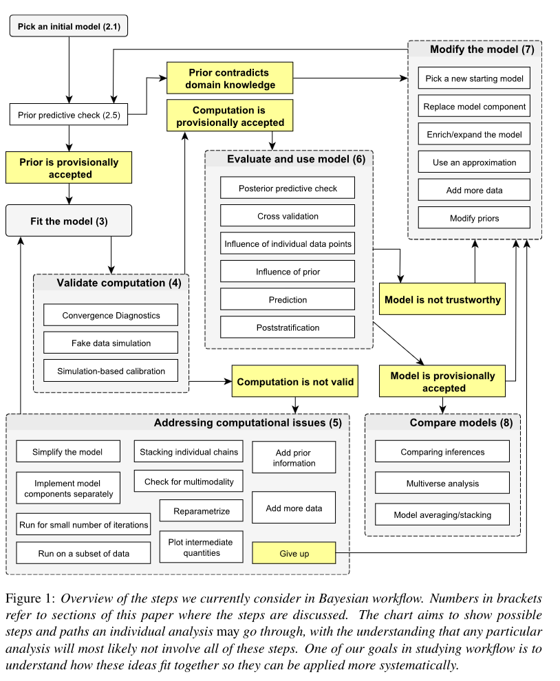

Includes material from Ian Dworkin and Jonathan Dushoff, but they bear no responsibility for the contents.


```{r setup, include=FALSE}
library(knitr)
library(pander)
library(emdbook)
```

```{r pkgs, message = FALSE}
library(brms)
library(lme4)
library(broom.mixed)
library(tidybayes)
```

## brain dump

* scale dependence
* issues with improper priors (scale dependence, identifiability/computational issues)
* issues with proper uniform priors

- Cromwell's rule [@lindleyBayesian1980]: don't exclude *possible* values

## squashing problems

* 'wide' on one scale $\neq$ noninformative on a transformed scale
* especially for intervals, e.g. probabilities
* for positive distributions, uninformative *often* leads to a spike at zero (inverse-Gamma)

```{r stack, fig.width = 8}
sdval <- 3
par(mfrow = c(1,2), las = 1, bty = "l", xaxs = "i")
pc <- function(..., xlab = "", ylab = "") {
    cc <- curve(..., xlab = xlab, ylab = ylab)
    polygon(c(cc$x, rev(cc$x)), c(cc$y, rep(0, length(cc$y))),
            border = NA, col = "gray")
    curve(..., add = TRUE)
}
dlogitnorm <- function(x, mean = 0, sd = 1) {
    dnorm(qlogis(x), mean, sd)/(x*(1-x))
}
pc(dnorm(x, sd = sdval), from = -5*sdval, to = 5*sdval,
      main = "wide prior (log-odds scale)")
pc(dlogitnorm(x, sd = sdval), from = 1e-6, to = 1-1e-6,
      n = 601,
      main = "wide prior (probability scale)")
```

## stacking problems

* problems when informative (posterior squashing) @carpenterComputational2017

## priors for variances

* @gelmanPrior2006, 
* people used to use inverse-Gamma a lot (because conjugate)
* uninformative/wide → big spike at zero
* half-Normal, half-$t$ are better
    * *parameter-expanded priors* in `MCMCglmm` @gelmanData2006
* regularizing priors [@chungNondegenerate2013] prevent 'singularity'
* singularity doesn't matter as much when fully Bayesian because we're integrating over the whole posterior


## choosing priors

* @singmannStatistics2023 ("using priors over inherently meaningful units instead of default priors on standardized scales")
* unitless (log, logit-transformed, standardized) parameters make it easier to choose [@schielzethSimple2010]
* choose a 'wide range' as e.g. $\pm 2\sigma$ or $\pm 3\sigma$ of a Normal (or $t$) prior: @inchaustiStatistical2023, @wanEstimating2014
* use prior information but dilute it: @ibrahimpower2015

## prior sensitivity

- compare results with different priors: @cromeNovel1996

* more general refs: @bannerUse2020;  ; @edwardsComment1996; @nicenboimIntroduction2023 (chap 3); @gelmanBayesian2020; @xieMeasures2006; @kallioinenDetecting2022; @finkcompendium1997; @sarmaPrior2020
* **lots** here (kind of a grab bag): https://github.com/stan-dev/stan/wiki/Prior-Choice-Recommendations
* https://www.monicaalexander.com/posts/2020-28-02-bayes_viz/

## Bayesian workflow

This figure from @gelmanBayesian2020 is a little overwhelming. It is more targeted toward people who are developing new Bayesian models from scratch rather than using a platform like `brms` but can still be useful.



## baseline prior choices

See [distribution explorer](https://distribution-explorer.github.io) ([backend](https://github.com/distribution-explorer/distribution-explorer.github.io))

- real-valued parameters: regularizing Gaussian
- variances: half-Student-t on the standard deviation scale *or* log-Normal
- other positive-valued: Gamma or log-Normal
   * older: inverse-Gamma for 
- correlation/covariance matrices
   * [LKJ](https://distribution-explorer.github.io/multivariate_continuous/lkj.html) or "onion" [@lewandowskiGenerating2009a]. $\eta=1$ $\to$ uniform, $\eta>1$ favours a stronger diagonal (smaller correlations)
   * Wishart (older): 

## References

::: {#refs}
:::

---

Last updated: `r format(Sys.time(), "%d %B %Y %H:%M")`


