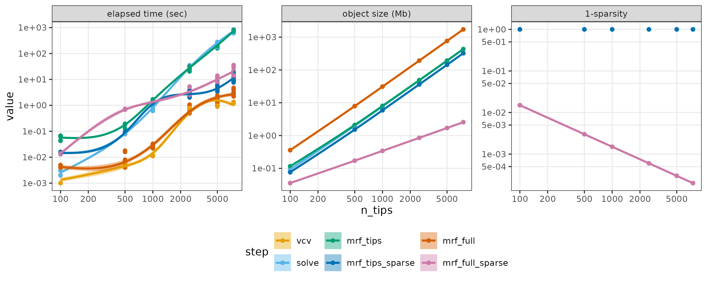
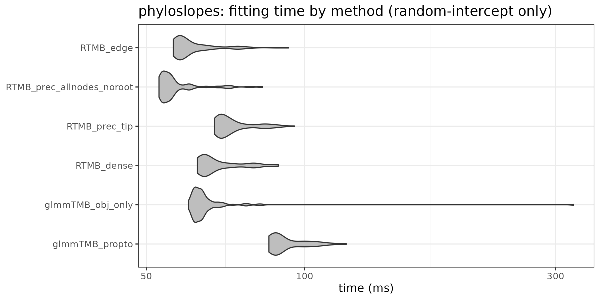

```{r pkgs, message=FALSE}
if (!require("MRFtools")) {
    stop('please remotes::install_github("eric-pedersen/MRFtools")')
    ##remotes::install_github("eric-pedersen/MRFtools")
}

## data / data manipulation
library(ade4)
library(ape)
library(dplyr)
library(tibble)  ## lst(), rownames_to_column()
## modeling
library(glmmTMB)
library(RTMB)
library(reformulas)
library(mgcv)
library(MRFtools)
library(Matrix)
## model diagnostics, etc.
library(bbmle) ## AICtab
library(performance)
library(ggplot2); theme_set(theme_bw())
library(cowplot)
library(broom.mixed) ## for tidy()
```

```{r utils}
source("phyloslopes_utils.R")
```

<!-- https://github.com/orgs/quarto-dev/discussions/1793 -->
<!-- LaTeX doesn't like newcommand in math mode; Pandoc doesn't care -->
\newcommand{\bA}{\mathbf A}
\newcommand{\bB}{\mathbf B}
\newcommand{\bI}{\mathbf I}
\newcommand{\bQ}{\mathbf Q}
\newcommand{\bZ}{\mathbf Z}
\newcommand{\bSigma}{\boldsymbol \Sigma}
\newcommand{\kron}[2]{#1 \otimes #2}
\newcommand{\bSphylo}{\boldsymbol \Sigma_{\textrm{phylo}}}
\newcommand{\bSwiggly}{\boldsymbol \Sigma_{\textrm{wiggly}}}
\newcommand{\bQphylo}{\mathbf Q_{\textrm{phylo}}}
\newcommand{\bQwiggly}{\mathbf Q_{\textrm{wiggly}}}
\newcommand{\bIphylo}{\mathbf I_{\textrm{phylo}}}
\newcommand{\bIwiggly}{\mathbf I_{\textrm{wiggly}}}
\newcommand{\sphylo}{\sigma_{\textrm{phylo}}}
\newcommand{\swiggly}{\sigma_{\textrm{wiggly}}}
\newcommand{\scomb}{\sigma_{\textrm{phylo} \otimes \textrm{wiggly}}}

This note covers two different topics:

* **implementing phylogenetic random-effect terms**: comparing computational efficiency of different methods for implementing a simple phylogenetic covariance term, i.e. a Brownian-motion evolutionary model of a single response [intercept-only random effect] on a tree. 
* **combining phylogenetic terms with other dimensions of variation**:
what are our options when fitting a random-slopes phylogenetic model, or a model with both phylogenetic covariance and a functional smooth (say, a thin-plate [penalized regression] spline)? This question parallels the examples in the 'GAM mafia' hierarchical-GAMs paper [@pedersenHierarchicalGeneralizedAdditive2019]; however, the hierarchical grouping variables there are unstructured iid groups, whereas I want to allow for phylogenetic structure among groups. This note is also similar to the suggestion by the example that @clarkPhylogeneticSmoothing2024 gives, although I consider more different options.

This note is inspired by a manuscript in progress with Maeve McGillycuddy *et al.* on the `propto` functionality in `glmmTMB`; it also draws on an older, incomplete project (manuscript/R package) with Mike Li ([phyloglmm](https://github.com/wzmli/phyloglmm/)).

Most of the examples below will be implemented in [RTMB](https://kaskr.r-universe.dev/RTMB) for flexibility and comparability, although I'll also compare some results with `glmmTMB` equivalents. I'm also going to stick to optimization/MLE fits for now, not considering Bayesian/sampling approaches. (The `phyloglmm` repo does a wider comparison across packages.)

## Implementing simple phylogenetic terms

Some of the choices in implementing a phylogenetic correlation/random effect term:

* should the phylogenetic structure be incorporated in the random-effects model matrix ($\bZ$) or in the covariance matrix ($\bSigma$)? (As pointed out e.g. by @hefleyBasisFunctionApproach2017, because the covariance matrix between *observations* is $\bSigma_{\textrm{obs}} = \bZ \bSigma \bZ^\top$, any combination of $\bZ$ and $\bSigma$ that give the same $\bSigma_{\textrm{obs}}$ will give an equivalent fit to the data. At the two extremes, we can encode all of the structure in $\bSigma$ (so that $\bZ$ becomes an indicator matrix for species) or all of the structure in $\bZ$ (so that $\bSigma$ becomes $\sigma^2_{\textrm{phylo}} \bI$).
* if $\bSigma$ has non-trivial structure, should we build the model on the covariance scale ($\bSigma$) or the precision scale ($\bQ$) ? In general $\bQ$ will be sparser than $\bSigma$.
    * inverting the phylogenetic covariance to get the precision matrix scales badly (${\cal O}(n^3)$) but is manageable up to moderately large trees (e.g. $\approx$ 8 minutes for a tree with 7500 tips). At least for the Brownian-motion phylogenetic model, the covariance (or precision) matrix only needs to be constructed once.
    * computing on the covariance scale can be convenient for dealing with singular fits [@batesFitting2015], but computing on the precision scale is generally advantageous both because of sparse-matrix computation and because the penalty/MVN-log-likelihood computation uses $\bQ$ directly.

For the examples below, I will use both the phylogenetic running-speed data set from @garlandDoes1993 (as provided by the `ade4` R package) [$\approx$ 50 species], used in McGillycuddy *et al.*'s ms., and the fish phylogeny as provided by the `fishtree` R package) [$\approx$ 11K species] [@raboskyinverse2018a].

### Cost of computing $\bSigma$ / $\bQ$

Summary of results (solely of computing $\bSigma$ or $\bQ$ or their sparse analogs - no consideration of their downstream efficiency - using random subsamples of the 11K tips fish phylogeny:

```{r sigma-q-plot}
#| echo: false

```

where:

* `vcv`: compute phylogenetic covariance matrix $\bSigma$ from phylogeny
* `solve`: invert $\bSigma$ to get $\bQ$
* `mrf_tips`: compute $\bQ$ based on tips only (no internal nodes) using `MRFtools::mrf_penalty.phylo`
* `mrf_tips_sparse`: convert previous object to a sparse matrix
* `mrf_full`: compute $\bQ$ including internal nodes (with `mrf_penalty.phylo`)
* `mrf_full_sparse`: convert to sparse representation

**FIXME/TODO**: can `MRFtools` do a better job maintaining sparsity throughout?

### Cost of fitting intercept-only phylogeny terms

While it's useful to know how expensive it is to compute $\bSigma$ or $\bQ$,
the actual model-fitting step probably takes longer (because we have to evaluate
expressions involving $\bSigma$ or $\bQ$ hundreds of times).

McGillycuddy et al. fit the model `log_rs ~ f(log_bm) + propto(0 + species | g, vcmat)` i.e.,
"log of running speed is linearly related to (a function of) log of body mass; phylogenetic covariance among species
follows the covariance matrix `vcmat`") to the data from @garlandDoes1993. They first consider a (log-log) linear model
for body mass, then a thin-plate spline. I'll start with the linear model, to focus on the computational cost of 
the phylogenetic term. I'll first show how to set up a series of `RTMB` models that implement different methods:

```{r read-chunks, include=FALSE}
knitr::read_chunk("phyloslopes_utils.R")
```

#### basic setup/glmmTMB model

```{r setup}
## FIXME: put this code elsewhere?
data("carniherbi49", package = "ade4")
chtree <- read.tree(text=carniherbi49$tre2)
chtree$tip.label <- fixup_species(chtree$tip.label)
vcmat <- vcv(chtree)  ## covariance matrix
chdat <- carniherbi49$tab2 |>
  mutate(log_bm = log(bodymass),
         log_rs = log(runningspeed),
         g = 1  ## dummy for grouping variable
         ) |>
  tibble::rownames_to_column("species") |>
  mutate(across(species, fixup_species)) |>
  mutate(across(species, \(x) factor(x, levels = rownames(vcmat))))
## check
stopifnot(identical(sort(rownames(vcmat)), sort(as.character(chdat$species))))
save(chdat, chtree, vcmat, file = "phyloslopes.rda")
```

The first model fitted by McGillycuddy *et al.*:

```{r fit1}
fit_propto_glmmTMB <- glmmTMB(log_rs ~ log_bm + propto(0 + species | g, vcmat),
                              data = chdat)
```

#### RTMB analog
An RTMB analog of this model:

```{r nllfun1}
#| eval: false
```

Setup to use this RTMB function to fit:
```{r rtmb1}
X <- model.matrix(~ log_bm, data = chdat)
Z <- fac2sparse(chdat$species)
## for intercept-slope model
us2 <- unstructured(2)
rt <- mkReTrms(findbars(~ (1 + log_bm | species)),
               fr = chdat, calc.lambdat = FALSE)
## move data into required wrapper
chdat_x <- c(chdat, lst(X, Z, vcmat))
p0 <- list(beta = rep(0, 2), b = rep(0, nrow(vcmat)), logsd=0, logpsd = 0)
obj <- MakeADFun(nllfun1, p0, silent = TRUE, random = "b")
fit_propto_TMB <- TMBfit(obj) ## wrapper to run nlminb() and store results
## check match
stopifnot(all.equal(fixef(fit_propto_TMB), fixef(fit_propto_glmmTMB)$cond,
                    check.attributes = FALSE, tolerance = 1e-7))
```

#### RTMB with precision matrix (hand-inverted)

We can change this to a precision-based approach by changing just the penalty line, to:

```{r nll_prec_fake}
#| eval: false
pen <- -dgmrf(b, 0, Q = phyloprec, scale = exp(-logpsd), log = TRUE)
```
(`dgmrf` stands for "distribution of a Gaussian Markov random field", i.e.
a multivariate Normal parameterized by its precision matrix)
and inverting the covariance matrix:
```{r phylo_prec}
chdat_x <- c(chdat, lst(X, Z, phyloprec = Matrix(solve(vcmat), sparse = TRUE)))
obj <- MakeADFun(nllfun_prec, p0, silent = TRUE, random = "b")
```

#### RTMB with internal-nodes precision matrix

`MRFtools::mrf_penalty()` offers the option (with `internal_nodes = TRUE`) of generating a penalty matrix that includes all of the internal nodes. To use this, we have to be a little careful because this full matrix includes the root, and is thus rank-deficient ($\textrm{rank}(\bQ) = \textrm{dim}(\bQ)-1$): the classic Brownian-motion "no fixed origin" singularity, since shifting every node (including the root) by the same constant leaves all edge contrasts unchanged. We drop the root's row/column from the precision matrix (and the corresponding column from `Z`), and change the length of `b` to match:

```{r phylo_prec_allnodes}
ntip <- length(chtree$tip.label)
Q_full_raw <- mrf_penalty(chtree, "brownian", internal_nodes = TRUE)
Q_allnodes <- drop_mrf_root(chtree, Q_full_raw)
## fac2sparse() returns levels x observations (the "Zt" convention); use
## placeholder levels 1:Nnode for the (never-observed -> all-zero-column)
## internal nodes, then transpose to the usual observations x levels form
Z_full <- t(fac2sparse(factor(chdat$species,
                              levels = c(seq_len(chtree$Nnode), chtree$tip.label)),
                       drop.unused.levels = FALSE))
Z_allnodes <- Z_full[, -1]
p0_allnodes <- modifyList(p0, list(b = rep(0, chtree$Nnode + ntip - 1)))
chdat_x <- c(chdat, lst(X, Z = Z_allnodes, phyloprec = Q_allnodes))
obj_prec_allnodes <- MakeADFun(nllfun_prec, p0_allnodes, silent = TRUE, random = "b")
fit_prec_allnodes <- TMBfit(obj_prec_allnodes)
```

These results are equivalent.

#### RTMB with Z-encoding

As pointed out above, and in the `phyloglmm` repo, we can encode the phylogenetic covariance in $\bZ$ instead of in $\bSigma$: this leaves $\bSigma$ as a indicator matrix for species (an identity matrix for this particular data set, which samples each species once). `phylo.to.Z()` builds a tip x edge matrix with a `sqrt(edge.length)` entry wherever an edge is ancestral to a tip, so `Z %*% b` with `b` iid unit-scale reproduces `vcv(chtree)` exactly -- no covariance/precision matrix needed ... the corresponding RTMB function can simplify the penalty term since the penalty matrix is diagonal: we don't need `dmvnorm`/`dgmrf` any more, can just use `sum(dnorm(...))` for the penalty:

```{r rtmb_edge}
#| eval: false
pen <- -sum(dnorm(b, 0, sd = exp(logpsd), log = TRUE))
```

Setup:

```{r phylo_edge}
pZ <- phylo.to.Z(chtree)
Z_edge <- pZ[as.character(chdat$species), ] ## reorder
p0_edge <- modifyList(p0, list(b = rep(0, nrow(chtree$edge))))
chdat_x <- c(chdat, lst(X, Z = Z_edge))
obj_edge <- MakeADFun(nllfun_edge, p0_edge, silent = TRUE, random = "b")
fit_edge <- TMBfit(obj_edge)
```

#### Timings

```{r bench-fig1}
#| echo: false

```

Where

* `RTMB_edge`: construction with phylogenetic structure in $\bZ$
* `RTMB_prec_allnodes`: with `mrf_penalty(., internal_nodes = TRUE)`
* `RMB_prec_tip`: with `mrf_penalty(., internal_nodes = FALSE)`
* `RTMB_dense`: with raw $\bSigma$ via `dmvnorm`
* `glmmTMB_obj_only`: optimizing the `glmmTMB` object, no overhead
* `glmmTMB_propto`: full `glmmTMB` call

This is a small problem, so it might be more informative to benchmark larger examples and see how the differences scale.

For what it's worth `phyr` is much faster: median (n=100) = 13.5 ms, 5th/95th percentiles = 8.6 ms / 16.0 ms. However, it may be less flexible (in terms of additional random-effect terms, weird conditional distributions, etc.). The `phyloglmm` repo does more systematic benchmarks across a wider range of packages. (Also worth considering `gllvm`.)

## Phylogenetic covariance combinations with other terms

### linear case

All the models above are additive: the species-level intercepts are phylogenetically correlated, 
but the effect of body mass on running speed (which we are modeling as a simple linear term here, but will switch to a thin-plate spline below)
is assumed to be homogeneous across species. As @schielzethConclusionsSupportOverconfident2009 (and many others) note,
modeling only variation of intercepts among clusters and not variation of effects (in this case the effect of body mass on running speed)
across clusters can be overoptimistic/anticonservative (not to mention missing potentially interesting phylogenetic variation).
We could use the hierarchical-GAM machinery from @pedersenHierarchicalGeneralizedAdditive2019 to model *independent* variation across
species, but what if we want to incorporate phylogenetic covariance?

In addition to the intercept-only/additive model above, we'll fit two models:

* independent phylogenetic variation in slopes and intercepts
* *separable* phylogenetic variation (implemented in two ways: via `dseparable` and via `phylo.Z` setup)

In a separable model, we construct the combined covariance matrix as $\kron{\mathbf A}{\mathbf B}$; that is, the element corresponding to the covariance between $ij$ and $kl$ (say, species $i$ and $j$ and spline parameters $k$ and $l$ will be $\sigma_{A,ij} \cdot \sigma_{B,kl}$. We do have to be careful about identifiability; if both $\bA$ and $\bB$ have overall adjustable scale parameters, then the Kronecker product will be jointly unidentifiable). With only a small loss of generality, suppose that $\textrm{diag}(\bB)$ is homogeneous and (without further loss of generality) equal to 1; then there will be repeated $\bA$ blocks along the diagonal of the product (assuming I have the Kronecker product defined the right way around). The basis matrices stay the same.

In theory, we could also fit a tensor-product smooth for this case (discussed more below), but in this case (where the model we are crossing with the phylogenetic structure, a simple linear regression, has no penalized/wiggly component), it would collapse to the separable case.

The null model (i.e. `~ 1 + (0 + propto | species, phylo)`), the additive linear model (adding a fixed effect of `log_bm`), and a model with independent random slopes (adding `(0 + bm | species)`) can all be fitted in the current version of `glmmTMB`; the separable model requires `RTMB` at present.

```{r nllfun_sep}
#| eval: false
```

(`mk_f_phylo` and `mk_f_cov` are helper functions, defined upstream, to generate phylogenetic and unstructured covariance MVN density functions)

Even the plain additive model barely improves the fit over the null model in this case; the independent model fit is singular and collapses back to the additive model; and the separable model gives a minor improvement.

```{r compare-linear-fits}
load("phyloslopes_linear.rda")
tt <- bbmle::AICtab(phyloslopes_linear_models, logLik = TRUE)
print(as.data.frame(tt), digits = 2)
```

### thin-plate spline

Moving on to the case where we include not just a linear term, but a separate penalized term --- following McGillycuddy *et al.* we'll use a thin-plate spline (although the general concepts would extend to other smooth/penalized terms: other one-dimensional splines, Gaussian random fields, etc.). The tricky part here is that we have to handle the null components of the model separately. In the case of the separable model, we first use `mgcv()`'s `smooth2random()` utility to separate the spline term into null-space components (which are treated as fixed effects, i.e. unpenalized) and into a random-effects basis where the covariance structure is encoded in the model matrix (as in the `phyloglmm` case discussed above), so that $\bSwiggly$ becomes diagonal. The covariance matrix corresponding to the penalty is
$$
\underbrace{\sphylo^2 \bSphylo}_{\textrm{phylo intercept}} +
\underbrace{\swiggly^2 \bSwiggly}_{\textrm{non-phylogenetic wiggle}} + \underbrace{\scomb^2 \left(\kron{\bSphylo}{\bSwiggly} \right)}_{\textrm{phylogenetic wiggle}}
$$

Implemented as follows:

```{r nllfun_spline_separable}
#| eval: false
```

The separable model reduces to the additive model if $\scomb \to 0$, i.e. `logpsd_f` $\to -\infty$.

For this problem we can also consider a tensor product smooth. As described in @woodGeneralizedAdditiveModels2017 section 5.6, the tensor product model matrix is built by combining the model matrices for each term via rowwise Kronecker products (see `mgcv::tensor.prod.model.matrix`); the tensor penalty is an additive combination of two separate penalty matrices, $\kron{\bQphylo}{\bIwiggly}$ and $\kron{\bIphylo}{\bQwiggly}$.[^tensor-reparam] As discussed above for the separable model, we also have to separate the components of $\bZ$ that correspond to the nullspace of the penalty and treat them as (unpenalized) fixed effects. This is done manually below, not using the built-in `te()` machinery from `mgcv` ... the penalty combines one term based on the tensor product precision,
$$
\sigma_{T1}^{-2} \kron{\bQphylo}{\bIwiggly} + \sigma_{T2}^{-2}\kron{\bIphylo}{\bQwiggly}
$$
and a null-space covariance matrix
$$
\kron{\bSphylo}{\bSigma_{\textrm{null}}}
$$
identical to the covariance matrix in the random-slopes linear model above.

This tensor-product construction is actually more flexible than `mgcv`'s default approach, which would set $\bSigma_{\textrm{null}}$ to $\sigma_{T1}^2 \bI_2$. It is (surprisingly) hard to get either this approach of `mgcv`'s to reduce to the additive model ...

[^tensor-reparam]: The Claude-generated code I use here does *not* (I think) use the reparameterization suggested on pp. 230-231 of @woodGeneralizedAdditiveModels2017; I think that means that 
> the penalties no longer have the interpretation in terms of (averaged) function shape that is inherited from the marginal smooths ... but I think (??) we still get the same overall fits. 

Tangentially, @woodGeneralizedAdditiveModels2017 is dismissive of the value of separable models; however, his example is extreme:
> For example, consider a smooth of 3 predictors constructed as a tensor product smooth of 3 cubic spline bases, each of rank 5. The resulting smooth would have 125 free parameters, but a penalty matrix of rank 27. This means that varying the weight given to the penalty would only result in the effective degrees of freedom for the smooth varying between 98 and 125: not a very useful range. By contrast, for the same marginal bases, the multiple term penalties would have rank 117, leading to a much more useful range of effective degrees of freedom of between 8 and 125.
For a model combining $N$ cubic splines each with $K$ knots, the covariance matrix has dimension $K^N$; the rank of the separable model is $(K-2)^N$; and the rank of the tensor spline basis is $K^N-2^N$. Thus the difference is the most extreme for small $K$ and large $N$. The chosen values ($K=N=3$ represent a low (but not unheard of) $K$ and a large $N$ (I had trouble finding a true three-way tensor product smooth in the literature: e.g. @augustinSpacetimeModellingBlue2013 uses a 2D spatial smooth crossed with a smooth term for depth ...)

### tiny example

[I've tried to come up with a simple way to get a more heuristic idea of what these models are doing, without too much success. It's hard to construct a problem that's small enough to visualize (i.e. few species, few knots in the spline) but large enough to fit without the models collapsing to singular or other non-identifiable cases]

Starting with a very small example that will (hopefully) allow visualizizing the penalty matrices/covariance matrices/etc. used by the different approaches. The example here uses a simple phylogeny with $S=5$ tips/species, with each species having a different $x$ value, and a thin-plate spline over $x$ with $K=4$.

| model     | penalty/variance params                                              | latent variables                                      | latent variables |
|-----------|-----------------------------------------------------------------------|---------------------------------------------------------|:---:|
| additive  | 2 — `logsd_f` (iid wiggle scale), `logpsd` (phylo intercept scale)    | 7 — `b_spline` (2) + `b_phylo` (5)                       | $(K-2) + S$ |
| separable | 3 — `logsd_f`, `logpsd_f` (phylo-correlated wiggle-deviation scale), `logpsd` | 17 — `b_spline` (2) + `b_wiggly` (10) + `b_phylo` (5)   | $S(K-1) + (K-2)$ |
| tensor    | 3 — `logpsd_null` (×2, one per null-space direction), `logpsd_range`  | 20 — `b_null` (10) + `b_range` (10)                      | $SK$ |


Here are plots of the covariances between the predicted values of species 1-5 at $x=3$ and their slopes at $x=3$. For this tiny example, the separable model collapses back to the additive model.

```{r tiny-plots}
#| fig-width: 9.4
#| fig-height: 8.6
L <- load("phyloslopes_tiny_predcovs.rda")
covs1 <- lapply(predcovs, \(x) x$cov)
covs1 <- c(covs1, list("separable-additive"= covs1[["separable"]]-covs1[["additive"]],
                       "separable-additive/true" = covs1[["separable/true"]]-covs1[["additive/true"]]))
cowplot::plot_grid(plotlist = Map(ifun, covs1, names(covs1)))
```

I still haven't figured out a great way to illustrate the differences among these approaches.

### spline effects

The analogous comparison with a smooth (thin-plate spline) trend in `log_bm` instead of a linear one: null (phylogenetic intercept only), additive, separable, and a genuine tensor-product smooth (see `phyloslopes_combo.R`, adapted from the additive/separable/tensor-product fits below).

```{r compare-spline-fits}
load("phyloslopes_combo.rda")
tt <- bbmle::AICtab(phyloslopes_combo_models, logLik = TRUE)
print(as.data.frame(tt), digits = 2)
```

### combinations of thin-plate splines and phylogenetic effects

### independent

### separable

`Z = t(rt$Zt)` orders its columns `[species-outer, trait-inner]` (each species' intercept/slope pair adjacent), so `b` (an `ntip x 2` matrix) must be flattened to match via `c(t(b))`, not `c(b)`

```{r fit_sep1}
p2 <- list(beta = rep(0, 2),
           b = matrix(0,
                      nrow = nrow(vcmat),
                      ncol = 2),
           logrsd=rep(0, 2),
           logsdres = 0,
           corval=0)
chdat_x <- c(chdat, lst(X, phylomat = vcmat, scale = 1, Z = t(rt$Zt), us2))
obj2 <- MakeADFun(nllfun_sep, p2, silent = TRUE, random = "b")
fit_sep <- TMBfit(obj2)
```

As a ground-truth check, we can also write out the *dense* Kronecker covariance directly: stack the 49 species x 2 traits into one 98-vector `b` with `b ~ N(0, Sigma2 %x% vcmat)`, no `dseparable()` abstraction involved.

```{r dense_slopes}
Zdense <- t(rt$Zt)
p0_ds <- modifyList(p0, list(b = rep(0, 2*nrow(vcmat)), logrsd = rep(0,2), corval = 0))
chdat_x <- c(chdat, lst(X, Zdense, vcmat, us2))
obj_ds <- MakeADFun(nllfun_dense_slopes, p0_ds, silent = TRUE, random = "b")
fit_dense_slopes <- TMBfit(obj_ds)
```

`fixef(fit_sep)` and `fixef(fit_dense_slopes)` now agree (as do their `logLik`s), confirming `dseparable()` really does implement the `Sigma2 %x% vcmat` covariance.

Now the edge-based version, answering the to-do question below ("does the Z-matrix random-slopes model match the separable model?"): `KhatriRao(t(pZ), t(J))` builds a `nobs x (2*nedge)` matrix whose columns are ordered `[edge-outer, trait-inner]` -- each edge contributes an (intercept-innovation, slope-innovation) pair. Propagating an edge-level, iid-across-edges, 2x2-correlated Brownian innovation up the tree induces `Cov(trait_a_i, trait_b_j) = Sigma2[a,b] * vcmat[i,j]` for species `i,j` -- exactly the same separable covariance as above, just built without ever forming `vcmat` or a covariance/precision matrix at all.

```{r phylo_edge_slopes}
f <- ~ 1 + (1 + log_bm | species)
J <- eval(bquote(model.matrix(~.(findbars(f)[[1]][[2]]), data = chdat)))
pZ <- phylo.to.Z(chtree)
## reorder pZ's tip-label rows to match chdat's (species-factor) row order
pZ_ord <- pZ[as.character(chdat$species), ]
KR <- t(KhatriRao(t(pZ_ord), t(J)))

p0_es <- modifyList(p0, list(b = rep(0, 2*nrow(chtree$edge)), logrsd = rep(0,2), corval = 0))
chdat_x <- c(chdat, lst(X, KR, us2))
obj_es <- MakeADFun(nllfun_edge_slopes, p0_es, silent = TRUE, random = "b")
fit_edge_slopes <- TMBfit(obj_es)
```

`fixef(fit_edge_slopes)` and `logLik(fit_edge_slopes)` match `fit_sep`/`fit_dense_slopes` too (all three agree to several significant figures) -- so yes, the edge-based `Z`-matrix random-slopes model is exactly the separable model, just reparameterized.

### tensor-product

```{r tp_tests}
## FIXME: tensor.prod.model.matrix()/tensor.prod.penalties() both use the
## convention "first list element = outer block, second = inner" (verified
## against small test matrices in phyloslopes_tiny.R/phyloslopes_tiny_explore.R). tX below is built from
## list(Z, X) (phylo outer, trait inner) but tp is built from list(diag(2),
## solve(vcmat)) (trait outer, phylo inner) -- reversed, so tp's and tX's
## columns don't actually line up. Harmless for now since tp/tX are never
## combined into a fitted nllfun_* here, but fix the order (phylo first) if
## this ever gets wired into a real fit.
tp <- tensor.prod.penalties(list(diag(2), solve(vcmat)))
lapply(tp, dim)
plot_grid(plotlist = lapply(tp, ifun))
tX <- tensor.prod.model.matrix(list(Z, as(X, "dgCMatrix")))
dim(tX)
```

I believe based on Wood (2006) that we need the penalty to be the sum of the scales/penalty values times (`penalty %*% b`), with
the `b` reused in each case. (Does the `scale` parameter of `RTMB::dgmrf` apply in the opposite direction, i.e. do we need
`RTMB::dgmrf(S, scale = 1/sd)` ?

I think in this case it's OK that the null space is empty - we do want this 'random effect' to disappear completely
as the penalty goes to infinity.

**Is the separable random-slopes model (above) nested in this tensor-product model?** No. For `b` laid out species-outer/trait-inner (so the separable covariance is `Sigma_full = vcmat %x% Sigma2`), the separable model's precision is a Kronecker *product*
$$Q_{sep} = S_{phylo} \otimes P_{trait,sep},$$
while summing `-dgmrf()` over `tensor.prod.penalties(list(Sphylo, Ptrait))` gives a Kronecker *sum*
$$Q_{add} = S_{phylo} \otimes I_2 \;+\; I_{ntip} \otimes P_{trait,add}.$$
Both are diagonalized by the same rotation $V \otimes I_2$, where $S_{phylo} = V\Lambda V^\top$ ($\Lambda=\mathrm{diag}(\lambda_1,\dots,\lambda_{49})$). In that basis, block $i$ of $Q_{sep}$ is $\lambda_i P_{trait,sep}$ and block $i$ of $Q_{add}$ is $\lambda_i I_2 + P_{trait,add}$. Matching every block simultaneously requires
$$P_{trait,add} = \lambda_i\,(P_{trait,sep} - I_2) \quad \text{for all } i = 1,\dots,49,$$
which is impossible unless $P_{trait,sep} = I_2$ (which forces $P_{trait,add}=0$, not a valid precision matrix), since $S_{phylo}$'s eigenvalues are not all equal (range $\approx 0.0032$-$3.33$ for this tree, i.e. $S_{phylo}$ is not proportional to $I_{ntip}$). So the separable model is *not* a special case of this tensor-product-penalty model -- Kronecker product and Kronecker sum are different families of precision matrices, and no choice of the free 2x2 trait-precision parameters lets the tensor-product model exactly reproduce the separable one.

This matches what happens numerically: fitting this model (`Sphylo` fixed/unscaled, `Ptrait` built from 3 free parameters -- two log-sds and a correlation, then inverted) converges to a much worse fit (logLik $\approx -180$ vs. $-6.5$ for the separable model) and lands on a genuine saddle point -- the profiled Hessian (via `numDeriv::jacobian(obj$gr, ...)`) has substantial negative eigenvalues (e.g. $-3011,-107$ from an all-zero start; $-55,-7.3$ from a warm start at the separable model's optimum) -- regardless of how the trait correlation is parameterized (`unstructured(2)`'s internal transform vs. the glmmTMB-vignette mapping $\rho=\theta/\sqrt{1+\theta^2}$ give near-identical results). The optimizer keeps pushing the correlation toward its boundary, trying (and failing) to approximate the unreachable separable structure.

**Follow-up (see `phyloslopes_tiny_explore.R`):** wiring up and fitting this exact Kronecker-sum construction (`nllfun_tensor`) on small simulated examples (`ntip` = 5 and 10) -- including data simulated *correctly* under the model itself, with strong signal (`sigma_1 = sigma_2 = 2 >> sigma_resid = 0.1`) and enough replication that this isn't just an interpolation artifact -- confirms a genuine, reproducible non-identifiability between the two variance-component scales (one always runs off toward a boundary; verified via multi-start that this is the true global optimum, not a bad start). It's not fixed/random (`X`/`tX`) aliasing. The cause is specific to `Ptrait/Strait` being a trivial, structureless, full-rank identity matrix (`diag(2)` here) -- indistinguishable from a generic flat ridge, so the model can't tell "shrink toward phylogenetic similarity" apart from "shrink generically." It does **not** generalize to a genuine tensor-product smooth of phylogeny x a spline (see the "tensor-product smooth" section below): a trait-side penalty with real internal (null/range) structure, like a TPS penalty, avoids the redundancy even fed into this same naive shared-`dgmrf()` construction. The "tensor-product smooth" section's actual approach -- eigendecompose null/range space first, give each its own separate Kronecker-*product* term rather than summing into one shared precision -- also sidesteps it when applied back to this plain intercept+slope case.

## phylogenetic splines

McGillycuddy *et al.*'s `propto` manuscript (`main.tex`) fits an *additive* model combining a penalized thin-plate-spline smoother of `log_bm` with a phylogenetic random intercept:
```
glmmTMB(log(runningspeed) ~ s(logbm) + propto(0 + species | g, mat), data = data,
        control = glmmTMBControl(optimizer = optim, optArgs = list(method = "BFGS")))
```
the two random effects (spline wiggle, phylogenetic intercept) are completely independent, summed in the linear predictor. Here we redo this comparing three structures: (1) that additive model, (2) a *separable* model where the spline's wiggly coefficients also get their own (single-scale) phylogenetically-correlated component, and (3) a genuine tensor-product smooth of phylogeny x `log_bm`.

```{r spline_setup}
## thin-plate spline marginal for log_bm; absorb.cons=TRUE matches glmmTMB's
## internal s() handling (its own sum-to-zero identifiability constraint) --
## essential for an exact match below, not just a convenience
sm <- smoothCon(s(log_bm, k = 10), data = chdat, absorb.cons = TRUE)
sm2ran <- smooth2random(sm[[1]], "", type = 2)
Xf <- sm2ran$Xf              ## fixed (linear-in-log_bm) design, 49 x 1
Xfull <- cbind(1, Xf)        ## + intercept column, so beta = c(intercept, linear coef)
Xr <- sm2ran$rand$Xr         ## wiggly random-effect design, 49 x 8, iid-equivalent
Kw <- ncol(Xr)

## cross the wiggly basis with the phylo indicator for the separable model
## below (species-outer/wiggly-inner, matching earlier tensor.prod.model.matrix
## conventions -- Zphylo needs transposing first, same fac2sparse gotcha as always)
Xr_joint <- tensor.prod.model.matrix(list(as(t(Zphylo <- fac2sparse(chdat$species)), "dgCMatrix"),
                                          as(Xr, "dgCMatrix")))
```

### additive

```{r spline_additive}
p0_spadd <- list(beta = rep(0, 2), b_spline = rep(0, Kw), b_phylo = rep(0, nrow(vcmat)),
                 logsd = 0, logsd_f = 0, logpsd = 0)
chdat_x <- c(chdat, lst(Xfull, Xr, Zphylo, vcmat))
obj_spadd <- MakeADFun(nllfun_spline_additive, p0_spadd, silent = TRUE,
                       random = c("b_spline", "b_phylo"))
fit_spline_additive <- TMBfit(obj_spadd)
```

Validate against the paper's actual `glmmTMB` call (using `vcv(chtree, corr = TRUE)`, the standardized correlation matrix used in the paper -- an ultrametric tree makes this exactly proportional to our raw `vcmat`, so it's just a reparameterization, not a different model):

```{r spline_additive_check}
mat_corr <- vcv(chtree, corr = TRUE)[levels(chdat$species), levels(chdat$species)]
fit_spline_glmmTMB <- glmmTMB(log_rs ~ s(log_bm) + propto(0 + species | g, mat_corr), data = chdat,
                              control = glmmTMBControl(optimizer = optim, optArgs = list(method = "BFGS")))
stopifnot(all.equal(logLik(fit_spline_additive), c(logLik(fit_spline_glmmTMB)),
                    check.attributes = FALSE, check.class = FALSE, tolerance = 1e-4))
stopifnot(all.equal(fixef(fit_spline_additive), fixef(fit_spline_glmmTMB)$cond,
                    check.attributes = FALSE, tolerance = 1e-3))
```

`fixef(fit_spline_additive)` and `logLik(fit_spline_additive)` match `fit_spline_glmmTMB` exactly (intercept 3.894787 vs. 3.894789, `s(log_bm)` coefficient -0.007723 vs. -0.007724, logLik -6.14403 both) -- confirming the RTMB reimplementation reproduces the paper's model precisely.

### separable

Add a phylogenetically-correlated copy of the wiggly coefficients on top of the additive model's baseline (non-phylogenetic) wiggle -- a single extra scale (`logpsd_f`), diagonal across the `r Kw` wiggly dimensions, not a full covariance. Crucially this must be *added to*, not substituted for, the baseline `b_spline` term, so that the model properly nests the additive one (recoverable exactly as `logpsd_f -> -Inf`) rather than losing that flexibility entirely.

```{r spline_separable}
#| cache: true
p0_spsep <- modifyList(p0_spadd, list(b_wiggly = rep(0, nrow(vcmat)*Kw), logpsd_f = -10))
chdat_x <- c(chdat, lst(Xfull, Xr, Xr_joint, Zphylo, Kw, vcmat))
obj_spsep <- MakeADFun(nllfun_spline_separable, p0_spsep, silent = TRUE,
                       random = c("b_spline", "b_wiggly", "b_phylo"))
fit_spline_separable <- TMBfit(obj_spsep)
```

`fixef(fit_spline_separable)` and `logLik(fit_spline_separable)` match `fit_spline_additive` exactly, with `logpsd_f` collapsing to its floor -- the data don't support any *additional* phylogenetically-correlated wiggle beyond the plain iid term, so the separable model correctly reduces to the additive one.

### tensor-product smooth

For a genuine tensor-product smooth of phylogeny x `log_bm`, `Sphylo = solve(vcmat)` is always full rank (no null space of its own), so *any* direction of the spline crossed with it stays fully regularized -- there's no risk of feeding `dgmrf()`/`dmvnorm()` a rank-deficient precision as long as we handle the *spline's own* null space (constant + linear, rank-deficient by construction) before crossing it with phylogeny, rather than trying to eigendecompose the full rank-deficient joint tensor penalty (or worse, passing it straight to `dgmrf()`, which silently returns `NaN` for a singular `Q`). `mgcv::smooth2random()` can't be used here directly for a `te()` term (only `t2()`, whose all-iid ANOVA-style reformulation exists to keep every marginal precision-free -- exactly the kind of arbitrary-precision-matrix restriction RTMB's `dgmrf()` doesn't need); instead we reuse `smooth2random()` on the *marginal* spline smooth, exactly as `spline_setup` above already does for additive/separable -- no separate `eigen()` call needed. `smooth2random()`'s `trans.D` component is `1/sqrt(d_i)` for each range-space eigenvalue (dummy `1`s appended for the null-space directions), in exactly the same column order as `Xr` -- verified numerically (`1/trans.D^2` reproduces a manual eigendecomposition's eigenvalues exactly, and the two `Xr`s agree column-by-column up to an immaterial sign flip) -- so `d_range <- 1/trans.D[seq_len(Kr)]^2` recovers the raw eigenvalues `nllfun_spline_tensor`'s range-block penalty needs, with no duplicated computation. Note this needs a *fresh* (non-`absorb.cons`) `smoothCon()`/`smooth2random()` pair: `sm`/`sm2ran` above already have the constant direction folded away (a 9-dim basis with a 1-dim null space), which would leave only one combined null-space scale instead of two separately-shrinkable ones.

```{r spline_tensor_setup}
sm_full <- smoothCon(s(log_bm, k = 10), data = chdat)  ## no absorb.cons -- want the full null space
sm2ran_full <- smooth2random(sm_full[[1]], "", type = 2)
Xf_null <- sm2ran_full$Xf                                                          ## 49 x 2: [linear, constant]
Xr_range <- sm2ran_full$rand$Xr                                                    ## 49 x 8, Wood's sqrt(D) reparam
Kn <- ncol(Xf_null); Kr <- ncol(Xr_range)
d_range <- 1 / sm2ran_full$trans.D[seq_len(Kr)]^2                                  ## true TPS range-space eigenvalues (pre-whitening)

tZphylo <- as(t(Zphylo), "dgCMatrix")
Xnull_joint <- tensor.prod.model.matrix(list(tZphylo, as(Xf_null, "dgCMatrix")))   ## 49 x 98
Xrange_joint <- tensor.prod.model.matrix(list(tZphylo, as(Xr_range, "dgCMatrix"))) ## 49 x 392

## range-block penalty components, precomputed once (pure functions of data,
## not parameters -- see nllfun_spline_tensor)
Sphylo <- solve(vcmat)
Qr_phylo <- kronecker(Sphylo, diag(Kr))
Qr_smooth <- kronecker(diag(nrow(vcmat)), diag(d_range))
```
The two null-space directions (constant and linear-in-`log_bm`) need *separate* scales -- a single shared scale can't shrink away the (unsupported) phylo-slope variation without also killing the (well-supported) phylo-intercept variation, giving a much worse fit than necessary. The range (wiggly) block similarly needs *two* separate scales, not one: a pure Kronecker-product penalty (`Sphylo x I_Kr`, one knob) only lets the optimizer trade off overall phylo-shrinkage, with no way to separately penalize wiggliness the way GAM smoothing normally does. Following Wood (2006, sec. 4.1.8)'s "multiple term" recipe for the range block specifically -- `Sphylo x I_Kr` plus the TPS's own eigenvalue-weighted smoothness penalty `I_ntip x diag(d_range)`, each with its own scale -- recovers that missing degree of freedom. See `README_tensor.qmd` for the full derivation, including why a *naive* application of this same multiple-term recipe to the *whole* tensor penalty (no null/range split at all) is well-posed but strictly worse here, since it can only give the null space one shared scale.

`nllfun_spline_tensor` also takes an optional `cor_null` parameter, letting the two null-space directions' scales *correlate* rather than being independent (same `kronecker(phylomat, us2$corr(corval))` recipe as the `separable` linear model above, transplanted onto the spline's reparameterized null-space basis -- see `README_tensor.qmd`'s "null block" section). It's held fixed at 0 (independent, the behavior described above) via `map=` here; freeing it gains a little more logLik but lands near a correlation boundary on this data, so it isn't the default.

```{r spline_tensor}
#| cache: true
p0_sptensor <- list(beta = rep(0, 2), b_null = matrix(0, nrow(vcmat), Kn), b_range = rep(0, nrow(vcmat)*Kr),
                    logsd = 0, logpsd_null = rep(0, Kn), cor_null = 0,
                    logsigma1_range = 0, logsigma2_range = 0)
chdat_x <- c(chdat, lst(X, Xnull_joint, Xrange_joint, Qr_phylo, Qr_smooth, vcmat, us2))
obj_sptensor <- MakeADFun(nllfun_spline_tensor, p0_sptensor, silent = TRUE,
                          random = c("b_null", "b_range"),
                          map = list(cor_null = factor(NA)))
fit_spline_tensor <- TMBfit(obj_sptensor)
```

Unlike the null/range decomposition with a pure-product range block (which collapsed all the way to `fit_dense`/`fit_prec`'s tip-only fit), this version finds real extra signal: `logLik(fit_spline_tensor)` beats both the old pure-product-range construction and the naive `te()`-extracted construction discussed in `README_tensor.qmd` -- confirming that the separate null-space scales and the multiple-term range-block penalty are both independently worth having, not substitutes for one another. As before (and unlike the earlier random-slopes tensor-product exploration), the profiled Hessian has no negative eigenvalues -- a well-posed fit, not a saddle. It still does *not* beat `fit_spline_additive`/`fit_spline_separable` (logLik -6.144 there vs. -6.163 here) -- the tensor smooth's extra flexibility (and extra parameters, penalized further by AIC) simply isn't earning its keep on this weak-signal, 49-species dataset; see `phyloslopes_combo.R`'s comparison for the complete four-way ranking.

## To do

* performance comparison (single phylo structure), on simulated data (as a function of tree size):
    * glmmTMB + propto
    * RTMB + dense phylo (tips only)
    * RTMB + sparse phylo (full matrix)
    * RTMB + Z-matrix (phyloglmm)
* which model does the Z-matrix with random slopes correspond to? (What is the implied correlation between species-A intercept and species-B slope? Does it match the separable model?) i.e. what is $\mathbf Z \boldsymbol \Sigma  \mathbf Z^\top$ (analytically or numerically) ... ?

```{r pic1}
ggplot(chdat, aes(runningspeed, bodymass, colour = clade)) +
  geom_point(size=4) +
  scale_x_log10() +
  scale_y_log10() +
  scale_colour_manual(values = c("darkred", "darkblue"))
```


## junk

```{r fit1_check, eval=FALSE}
performance::check_model(fit_propto_glmmTMB,
                         check = c("linearity",
                                   "homogeneity", "pp_check",
                                   "qq"))
```

## References
