<!-- 
apa.csl is a slightly hacked version of APA 
  (modified for "et al" after 2 authors in text)
-->
<!-- .refs is style for reference page (small text) -->
<style>
.refs {
   font-size: 16px;
}
h2 { 
 color: #3399ff;		
}
h3 { 
 color: #3399ff;		
}
.title-slide {
   background-color: #55bbff;
}
.forceBreak { -webkit-column-break-after: always; break-after: column; }
</style>
<!--    content: url(https://i.creativecommons.org/l/by-sa/4.0/88x31.png)
>
<!-- Limit image width and height -->
<style type="text/css">
img {     
  max-height: 560px;     
  max-width: 800px; 
}
</style>

```{r setup,echo=FALSE,message=FALSE}
library("ggplot2"); theme_set(theme_classic())
library("knitr")
opts_chunk$set(echo=FALSE,fig.width=4,fig.height=4,out.width=400)
```

# intro

## acknowledgements {.columns-2}

- "when I say 'I' i mean 'we' ..."
- **People** 
    - Guillaume Blanchet (Sherbrooke)
    - Anna Norberg (Univ of Helsinki)
    - Otso Ovaskainen (NTNU, Univ of Helsinki)
- **Institutions** ($$$)
    - NSERC
    - NimBIOS

## outline

- data set descriptions
- "bake-off" of species distribution models
      - esp. **joint** species distribution models

# data sets

## diatoms

<div style="float: left; width: 40%;">
- 7 stream systems $\times$
15 samples  
(105 samples total)
- 499 species
- *predictors*: shading, % particles, moss cover, water velocity, conductance, pH, water colour, total P
- use first 4 PCA axes

</div>

<div style="float: left; width: 60%;">

 

</div>

## fungi

<div style="float: left; width: 40%;">
- 29 forests  
(21 managed, 8 natural)
- 22,500 samples (logs)
- 321 species
- *predictors*: management status, log(diameter), decay class, decay class$^2$
</div>

<div style="float: left; width: 60%;">


<br>

</div>

## UK butterflies

<div style="float: left; width: 40%;">
- 2841 10 km $\times$ 10 km grid cells
- 55 species
- *predictors*: # growing days > 5 C, % broadleaf woodland, % coniferous woodland, % calcareous substrates

</div>

<div style="float: left; width: 60%;">
<table>
<tr>
<td>

<div style="font-size: 10px">
small pearl-bordered fritillary (*Boloria selene*)
</div>
<br>

<div style="font-size: 10px">
green hairstreak (*Callophrys rubi*)
</div>
<br>

<div style="font-size: 10px">
Holly blue (*Celastrina argiolus*)
</div>
</td>
<td>

</td>
</tr>
</table>
</div>

## Australian plants {.columns-2}

- 30,000 locations (600 used)
- 2729 herbaceous species
- salinity, wetness, rainfall

<table>
<tr>
<td>
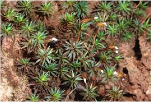
<br>
<div style="font-size: 10px">*Dawsonia longiseta*</div>
</td>
<td>

<br>
<div style="font-size: 10px">*Sclerodontium pallidum*</div>
</td>
</tr>
<tr>
<td>
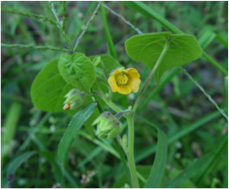
<br>
<div style="font-size: 10px">*Abutilon theophrasti*</div>
</td>
<td>

<br>
<div style="font-size: 10px">*Epilobium hirsutum*</div>
</td>


</tr>

</table>
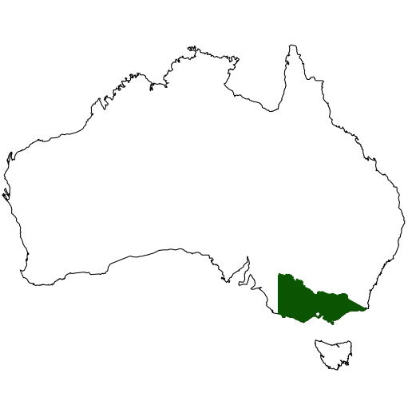


## US trees {.columns-2}

- 100,000 locations (600 used); 2000-2010
- 590 species
- first 3 PCA axes (out of 38 climate and soil variables)

<table>
<tr>
<td>
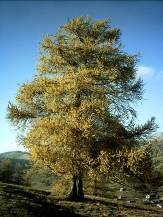
<br>
<div style="font-size: 10px">Larch</div>
</td>
<td>

<br>
<div style="font-size: 10px">Black spruce</div>
</td>
<td>
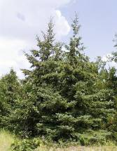
<br>
<div style="font-size: 10px">White spruce</div>
</td>
<td>
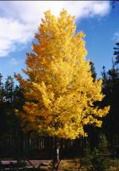
<br>
<div style="font-size: 10px">Aspen</div>
</td>
</tr>
</table>


# models

## Univariate (stacked SDMs)

- fit each species independently
    - **algorithmic**: boosted regression trees, random forest, support vector machine, multivariate regression trees, MARS, gradient nearest neighbour ...
    - **model-based**: GLM, GAM
- community-level predictions simply aggregate individual-species results

## Multivariate (joint SDMs)

- fit all species simultaneously, allow $\pm$ dependencies
    - species archetype models (SAM)
    - neural networks (MISTNET)
    - hierarchical GLM (HMSC)
- potential improvement in accuracy
- more direct community-level predictions

## sampling {.columns-2}

- hierarchical (discrete) vs. spatially explicit
- interpolation vs extrapolation
- some large data sets subsampled

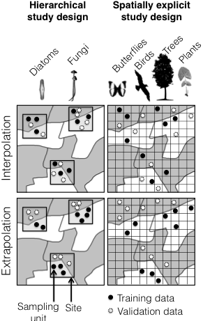


## assessment statistics {.columns-2}

- joint models *could* improve individual predictions ...
- ... but expect more obvious effects on community-level response

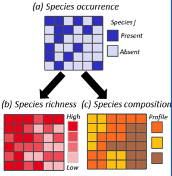

# results

## summary (terciles)

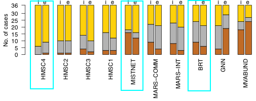
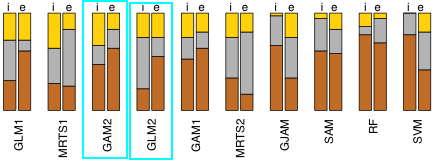

## summary<br>(species occupancy: Tjur $R^2$)

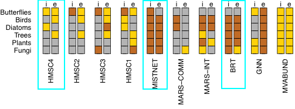


## summary<br>(species occupancy: deviance)

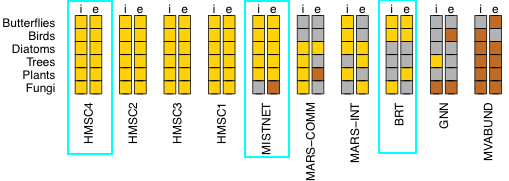
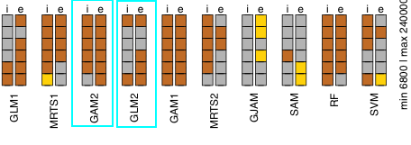

## summary<br>(species richness: MSE per site)


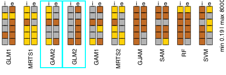

## timings

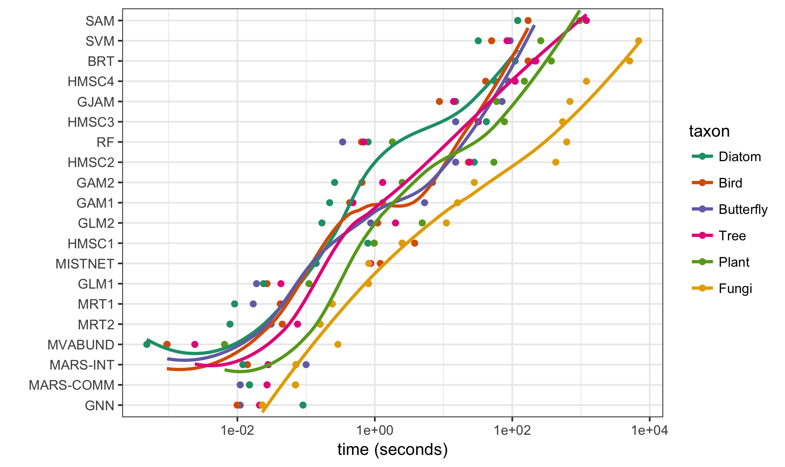

# discussion

## caveats

- work in progress
- methodological attribution fallacy
- algorithmic methods handicapped?
- fundamental vs. realized niche
- desirable extensions:  
dispersal, phylogenetic structure, trophic interactions


## phenomenological/mechanistic

- context-dependent
- many mechanisms per functional form:  
e.g. Michaelis-Menten/Monod/Beverton-Holt  
- **semimechanistic** models  
(@wood_partially_2001; e.g @merow_developing_2011)
- *linearizable* models (e.g. @dennis_estimating_2006)
- prediction vs estimation ...
<table>
<tr><td>
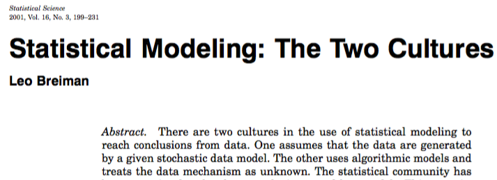
</td>
<td>
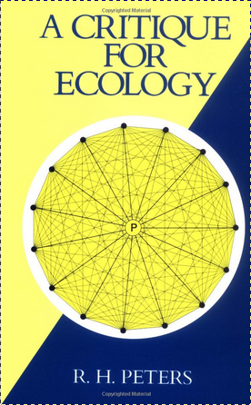
</td>
</tr>
</table>
<div style="font-size: 10px">
[@peters_critique_1991;@breiman_statistical_2001]
</div>

## the way forward

- tradeoffs/constraints
     - identifiability
	 - computational efficiency
	 - interpretability
	 - flexibility
- ecological-mechanistic $\leftrightarrow$  
model-based-statistical (nonlinear) $\leftrightarrow$
model-based-statistical (linear) $\leftrightarrow$  
algorithmic-statistical


## References {.refs}


