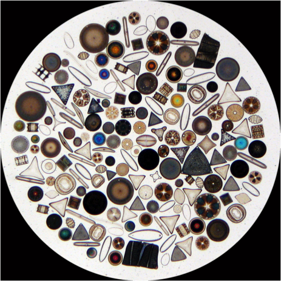
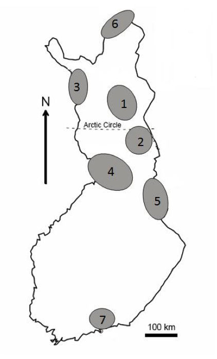
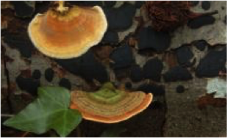
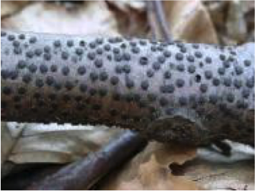
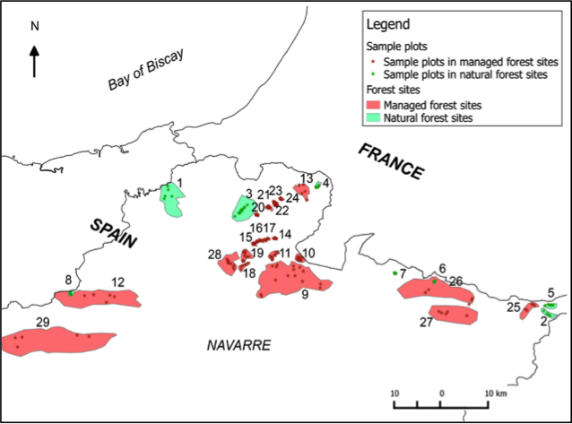
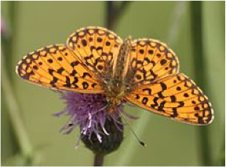
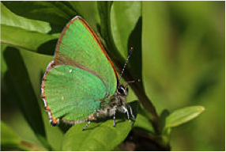
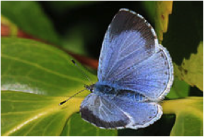
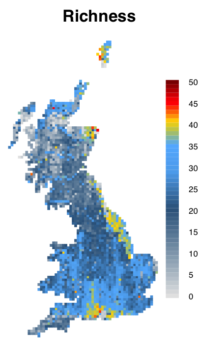

<!-- 
apa.csl is a slightly hacked version of APA 
  (modified for "et al" after 2 authors in text)
-->
<!-- .refs is style for reference page (small text) -->
<style>
.refs {
   font-size: 16px;
}
h2 { 
 color: #3399ff;		
}
h3 { 
 color: #3399ff;		
}
.title-slide {
   background-color: #55bbff;
}
.forceBreak { -webkit-column-break-after: always; break-after: column; }
</style>
<!--    content: url(https://i.creativecommons.org/l/by-sa/4.0/88x31.png)
>
<!-- Limit image width and height -->
<style type="text/css">
img {     
  max-height: 560px;     
  max-width: 800px; 
}
</style>

```{r setup,echo=FALSE,message=FALSE}
library("ggplot2"); theme_set(theme_classic())
library("knitr")
opts_chunk$set(echo=FALSE,fig.width=4,fig.height=4,out.width=400)
```

# intro

## acknowledgements {.columns-2}

- "when I say 'we' ..."
- Guillaume Blanchet
- Anna Norberg (
- Otso Ovaskainen (NTNU, )
- NSERC
- NimBIOS


# data sets

## diatoms

<div style="float: left; width: 40%;">
- 7 stream systems $\times$  
15 samples  
(105 samples total)
- 499 species
- *predictors*: shading, % particles, moss cover, water velocity, conductance, pH, water colour, total P
- first 4 PCA axes

</div>

<div style="float: left; width: 60%;">

 

</div>

## fungi

<div style="float: left; width: 40%;">
- 29 forests  
(21 managed, 8 natural)
- 22,500 samples (logs)
- 321 species
- *predictors*: management status, log (diameter), decay class, decay class$^2$
</div>

<div style="float: left; width: 60%;">


<br>

</div>

## UK butterflies

<div style="float: left; width: 40%;">
- 2841 10 km $\times$ 10 km grid cells
- 55 species
- *predictors*: # growing days > 5 C, % broadleaf woodland, % coniferous woodland, % calcareous substrates

</div>

<div style="float: left; width: 60%;">
<table>
<tr>
<td>

<br>
sp 1
<br>

<br>
sp 2
<br>

<br>
sp 3
</td>
<td>

</td>
</tr>
</table>
</div>

## Australian plants

- 30,000 locations (600)
- 2729 species
- salinity, wetness, rainfall

## US trees

- 100,000 locations (600)
- 590 species
- first 3 PCA axes (out of 38 climate and soil variables)


## 
# model types

# results

# discussion

## phenomenological/mechanistic

- definition is context-dependent:
the same function can be either
    - linear, quadratic
    - Michaelis-Menten/Monod/Beverton-Holt
	- many mechanisms per phenomenon:  
cf. the  *Strong Law of Small Numbers* [@guy_strong_1988]

## model-based statistics

- 
- ecological-mechanistic $\leftrightarrow$  
model-based-statistical $\leftrightarrow$  
algorithmic-statistical

[CITE Breiman]

## References {.refs}


