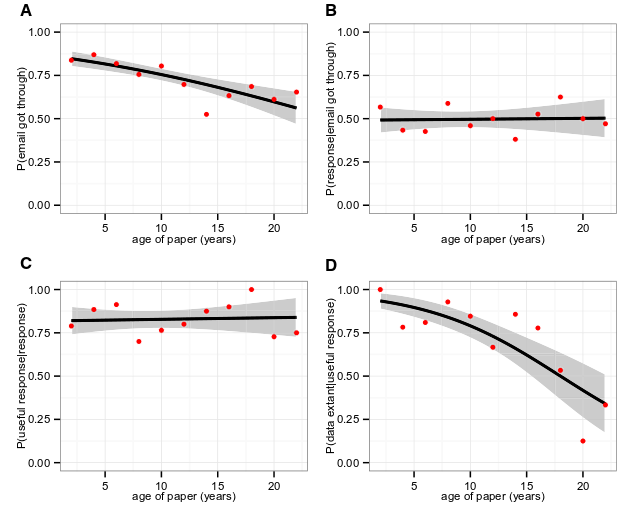

<!-- 
apa.csl is a slightly hacked version of APA 
  (modified for "et al" after 2 authors in text)
-->
<!-- .refs is style for reference page (small text) -->
<style>
.refs {
   font-size: 16px;
}
h2 { 
 color: #3399ff;		
}
h3 { 
 color: #3399ff;		
}
.title-slide {
   background-color: #55bbff;
}
</style>
<!--    content: url(https://i.creativecommons.org/l/by-sa/4.0/88x31.png)
>
<!-- Limit image width and height -->
<style type="text/css">
img {     
  max-height: 560px;     
  max-width: 800px; 
}
</style>

```{r setup,echo=FALSE,message=FALSE}
library("ggplot2"); theme_set(theme_classic())
library("reshape2")
library("ggExtra")
library("MASS")
library("knitr")
opts_chunk$set(echo=FALSE,fig.width=4,fig.height=4,out.width=400)
```

## outline

- academic publishing: origins and some of the current mess
- open data and reproducibility


# introduction

## why should you care?

what's in it for you?

- self-interest
- rules
- ethics

# academic publishing

## history

<div class="columns-2">

in the old days ...

- printing and distribution were expensive
- journals and books were the only way to disseminate scientific information
- indexing was hard


https://www.flickr.com/photos/7976207@N03/811269870

</div>

## what are the roles of scientific journals?

- peer-review (quality filter)
- editing (quality improvement)
- establish priority
- disseminate
- archive

## some new kids on the block

internet began to enable sharing and lower-cost distribution

- 1991: [ArXiv](https://en.wikipedia.org/wiki/ArXiv)
- 2000: [Faculty of 1000](https://en.wikipedia.org/wiki/Faculty_of_1000)
- 2003: [PLOS](https://en.wikipedia.org/wiki/PLOS)
- 2008: [ResearchGate](https://en.wikipedia.org/wiki/Researchgate)
- 2011: [figshare](https://en.wikipedia.org/wiki/Figshare)
- 2011: [Scihub](https://en.wikipedia.org/wiki/Scihub)
- 2012: [PeerJ](https://en.wikipedia.org/wiki/PeerJ)
- 2013: [bioRxiv](https://en.wikipedia.org/wiki/BioRxiv)
- 2018: [ecoevorxiv](https://www.ecoevorxiv.com/about.html)
- 2019: [medRxiv](https://www.medrxiv.org)

## open access 

- "green" open access: allow self-archiving
- "gold" open access: pay to make articles OA
     - many journals now allow gold option
- [tri-council rules](http://www.science.gc.ca/eic/site/063.nsf/eng/h_F6765465.html?OpenDocument):

> Grant recipients are required to ensure that any peer-reviewed journal publications arising from Agency-supported research are freely accessible within 12 months of publication.

## licensing

- what are your rights when you publish?
- what do you want to let people do?
- many ways to share
- [Creative Commons](https://creativecommons.org/)
     - e.g. CC BY, CC BY-SA, CC BY-NC, etc.

## journal classes

Open Access $\neq$ not-for-profit

- not-for-profit
- society
- commercial (e.g. Elsevier, Springer, Wiley, ...)
- predatory OA: [Beall's list](https://beallslist.weebly.com/)

## the [Ingelfinger rule](https://en.wikipedia.org/wiki/Ingelfinger_rule)

- journals won't accept previously published material
- @bourne_ten_2017:

>  very few journals consider preprints as a “prior form of publication” and reject such manuscripts on the grounds that they had been posted to a preprint server

- ... but check [SHERPA/Romeo](http://www.sherpa.ac.uk/romeo/index.php) !


## citation advantage of OA [@tennant_academic_2016] {.centered}


[OACA list](https://sparceurope.org/what-we-do/open-access/sparc-europe-open-access-resources/open-access-citation-advantage-service-oaca/oaca-list/)

## other ways to share

- academic social media: ResearchGate, Mendeley, academia.edu ?
     - what is the business model? 
	 - conditions of use? lock-in?
	 - ["If you are not paying for it, you're not the customer; you're the product being sold"](https://www.metafilter.com/95152/Userdriven-discontent#32560467)
- social media
     - twitter, FB, blogging
     - should you mix academic and personal media?
	 - do it well or don't do it
- [altmetrics](https://www.altmetric.com/)

## peer review

**problems**: unremunerated, biased, ...

experiments in peer review:

- double-blind
- open
- conversational/interactive
- crowdsourced ?
- [journal-independent](https://scholarlykitchen.sspnet.org/2017/03/20/wither-portable-peer-review/) (Peerage of Science, Rubriq)

# data

## why archive/share data?

- ethical obligation/good science
- re-use = visibility
- personal sanity: past-you and future-you

## data life history [@vines_availability_2014]



## [CIHR rules on data access](http://www.science.gc.ca/eic/site/063.nsf/eng/h_F6765465.html?OpenDocument)

>  Deposit bioinformatics, atomic, and molecular coordinate data into the appropriate public database (e.g. gene sequences deposited in GenBank) immediately upon publication of research results ...

> Retain original data sets for a minimum of five years after the end of the grant (or longer if other policies apply). This applies to all data, whether published or not.

## Should all data be open?

- human subjects: privacy issues
- commercial/IP issues
- "data parasites"

## data archiving

- Genbank etc.
- figshare
- Zenodo
- MacSphere
- DataDryad
- [list of repositories](http://oad.simmons.edu/oadwiki/Data_repositories)

## References {.refs}
