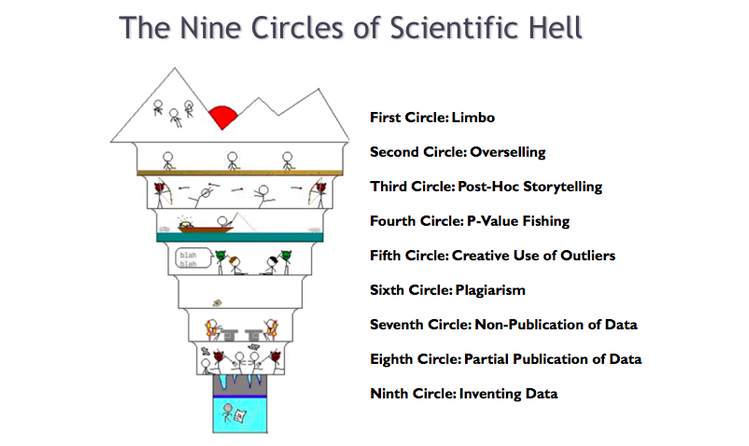
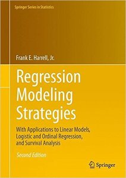
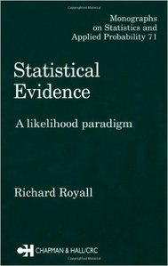

<!-- 
apa.csl is a slightly hacked version of APA 
  (modified for "et al" after 2 authors in text)
-->
<!-- .refs is style for reference page (small text) -->
<style>
.refs {
   font-size: 16px;
}
.sm_block {
   font-size: 20px;
}
h2 { 
 color: #3399ff;		
}
h3 { 
 color: #3399ff;		
}
.title-slide {
   background-color: #55bbff;
}
</style>
<!--    content: url(https://i.creativecommons.org/l/by-sa/4.0/88x31.png)
>
<!-- Limit image width and height -->
<style type="text/css">
img {     
  max-height: 560px;     
  max-width: 500px; 
}
div#before-column p.forceBreak {
	break-before: column;
}

div#after-column p.forceBreak {
	break-after: column;
}
</style>

```{r setup,echo=FALSE,message=FALSE}
library("ggplot2"); theme_set(theme_classic())
library("reshape2")
library("ggExtra")
library("MASS")
library("knitr")
opts_chunk$set(echo=FALSE,fig.width=4,fig.height=4,out.width=400)
```

## general advice

- "are my stats answering my scientific question?"
- "is there something simpler I can do that will still answer the question adequately"? [@murtaugh_simplicity_2007]
- use what the people around you use
- ... but not if they're wrong (if you can help it)
- experimental design $\gg$ statistics
- systematic error $\gg$ random error
- understand *as much as you can* about your methods

# computation

## learn about reproducibility

- learn some [data carpentry](http://www.datacarpentry.org/)
([workshop @ UF last year](http://reproducible-science-curriculum.github.io/2015-06-01-reproducible-science-idigbio/))
- transparency for scientific, career-enhancement, ethical, political (FOIA/ClimateGate) ... reasons
- "future you" is your most important collaborator

Resources:

- [Jenny Bryan's notes](https://stat545-ubc.github.io/)
- [more notes](https://github.com/bbolker/iiscvisit/blob/master/workshops/repro_research.pdf)
- [R. Fitzjohn: reproducible research in the R ecosystem](https://github.com/richfitz/reproducibility-2014)


## ask good questions <br>("how not to get flamed on the R list") {.columns-2}

- do your homework
- create a *minimal reproducible example*
- give enough context  
(avoid "X-Y problems")
- be careful about "bugs" and "crashes" (call them "infelicities" instead)

<p forceBreak></p>
 [the Allium](http://www.theallium.com/engineering/computer-programming-to-be-officially-renamed-googling-stackoverflow/)

## give back to the community

- cite software
- report bugs (as much detail as possible)
- make suggestions
- help others

## trusting R packages

- how long has the package been around?
- is there an associated peer-reviewed paper?
- who wrote it?
- how widely used is it?
- does it have a vignette?
- is the documentation any good?
- does it have tests?

## toolboxes {.columns-2}

- JAGS/BUGS, AD Model Builder, Template Model Builder, Stan ...
- power tools!
- freedom from many constraints
- fit almost any model, whether it's sensible or not ... [@lavine_living_2010]

-- 

<!-- -->

<p class="forceBreak"></p>

<p class="forceBreak"></p>

<div class="sm_block">
> I never blamed the Hole Hawg; I blamed myself. The Hole Hawg is
dangerous because it does exactly what you tell it to. It is not bound
by the physical limitations that are inherent in a cheap drill, and
neither is it limited by safety interlocks that might be built into a
homeowner's product by a liability-conscious manufacturer. The danger
lies not in the machine itself but in the user's failure to envision
the full consequences of the instructions he gives to it ...

Neal Stephenson, ["In the beginning was the command line"](http://www.cryptonomicon.com/beginning.html)

Beware: MCMC sampling can be dangerous! [WinBUGS manual](http://www.mrc-bsu.cam.ac.uk/wp-content/uploads/manual14.pdf)
</div>

# statistics

## learn about p-hacking {.columns-2}

- **exploration**
- **confirmation**  
(hypothesis testing, most model selection)
- **prediction** ...

<!-- -->


be honest!

- pre-register your analyses, at least informally
- don't select and then confirm!
(the gospel of the "minimal adequate model")

<p class="forceBreak"></p>

http://imgur.com/gallery/jyHgk

## read (some of) these

  

## prioritize

- pick **at most** two of the following:
    - big data
	- structure   
(phylogenetic, spatial, temporal, general blocking)
    - non-Normal distributions  
(binomial, Poisson < zero-inflated, ordinal < censored ...)
	- observation/occupancy modeling
	- multi-causality (structural equation models)
- try to ignore the rest (null hypothesis tests)

## learn some likelihood

  

## learn some linear algebra

- focus on concepts and geometry
- analogies with scalar analogues, e.g.   
$(\mathbf x- \boldsymbol\mu) \mathbf V^{-1} (\mathbf x- \boldsymbol\mu)^\top \approx (x-\mu)^2/\sigma^2$

- biological meanings of mathematical objects
- e.g. eigenvectors ...
    - stable age distribution
	- combination of environmental properties
	- combination of morphometric measurements
- mostly ignore computational details
- *sparse* matrices

## learn about linear models

- $\mathbf y \sim \textrm{Normal}(\mathbf X \boldsymbol \beta)$
- *model matrix* $\mathbf X$ captures contrasts among categories,
interactions among variables, more
- underpins most practical statistical models
- many extensions (generalized, mixed, additive ...)
- component of more complex (nonlinear/hierarchical/survival) models

## further resources

- @crome_researching_1997
- @hurlbert_pseudoreplication_1984 : also @oksanen_logic_2001, @cottenie_comment_2003
- @hobbs_bayesian_2015

<!-- http://stackoverflow.com/questions/30990262/applying-css-to-make-code-smaller-in-ioslides-style -->

## alternative title

**Computational ecology: state-of the-science, challenges and opportunities**

- mixed models and extensions
- models for animal movement: putting the pieces together
- new toolboxes for hierarchical computation
- (machine learning algorithms)
- penalization, shrinkage, and mixed models [@dahlgren_alternative_2010]
- complex models: model misspecification and overfitting
- estimation for nonlinear time series

## References {.refs}

