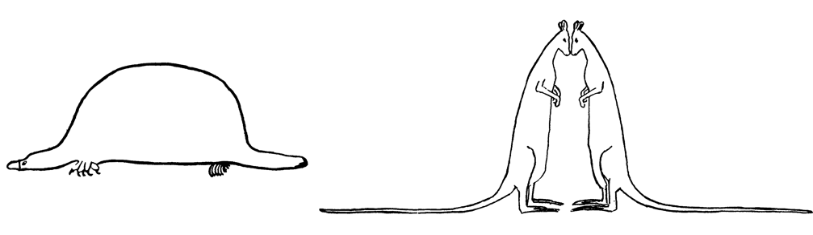

<!-- 
apa.csl is a slightly hacked version of APA 
  (modified for "et al" after 2 authors in text)
-->
<!-- .refs is style for reference page (small text) -->
<style>
.refs {
   font-size: 14px;
}
h2 { 
 color: #3399ff;		
}
h3 { 
 color: #3399ff;		
}
.title-slide {
   background-color: #55bbff;
}
</style>
<!--    content: url(https://i.creativecommons.org/l/by-sa/4.0/88x31.png)
>
<!-- Limit image width and height -->
<style type="text/css">
img {     
  max-height: 560px;     
  max-width: 800px; 
}
</style>

```{r setup,echo=FALSE,message=FALSE}
library("ggplot2"); theme_set(theme_classic())
library("reshape2")
library("ggExtra")
library("MASS")
library("knitr")
library("tidyverse")
opts_chunk$set(echo=FALSE,fig.width=4,fig.height=4,out.width=400)
th_clean <- 
  theme(panel.spacing=grid::unit(0,"lines"),
        axis.ticks.x=element_blank(),
        axis.text.x=element_blank(),
        axis.ticks.y=element_blank(),
        axis.text.y=element_blank()
        )
```

## outline

- experimental design
- statistical philosophy 
- statistical tests & assumptions
- analysis platforms


# experimental design

## the most important thing {.build}

> - Design your experiment well and execute it well:  
you needn't worry too much in advance about statistics
> - Don't: you're doomed - statistics can't save you 
> - **randomization**, **replication**, **control**

## randomization

- random *assignment to treatments*
- poorer alternative: *haphazard* assignment  
("convenience sampling")
- stratification  
(i.e., randomize within groups)
- related: experimental *blinding*

## replication {.build}

> - how big does your experiment need to be?
- **power**: probability of detecting an effect of a particular size,  
if one exists
    - more generally: how much information? what kinds of mistakes? [@gelman_beyond_2014] 
> - *underpowered* studies
>      * failure is likely
>      * cheating is likely
>      * *significance filter* $\to$ biased estimates
- *overpowered* studies waste time, lives, $$$
> - **pseudoreplication** [@hurlbert_pseudoreplication_1984;@davies_dont_2015]
confounding sampling units with treatment units

## power analysis

- need to guess *effect size* and variability
    - minimum *interesting* biological effect size
    - previous studies
    - ask your supervisor
- OK to simplify design (e.g. ANOVA $\to$ $t$-test)
- methods
    - seat-of-the-pants
    - [web calculators](http://homepage.stat.uiowa.edu/~rlenth/Power/)
    - in R
```{r pow_funs,eval=FALSE,echo=TRUE}
apropos("^power")  ## base-R functions
library("sos"); findFn("{power analysis}")
```

## power analysis example

With $n=15$ per group, can we see a clear difference between 10% (control) and 20% (treatment) mortality?

<!-- would like to highlight power: line, but too hard -->
```{r pow,echo=TRUE}
power.prop.test(n=15,p1=0.1,p2=0.2)
```

Uh-oh.

---

How many samples per group would we need to get power=0.8?

```{r pow2,echo=TRUE}
power.prop.test(power=0.8,p1=0.1,p2=0.2,sig.level=0.05)
```

Uh-oh.

---

<div style="font-size:40px; margin:auto; width:50%">
**what should we do?**
</div>

## increasing power (control)

- increase sample size (ugh)
- maximize *desired* variation (e.g. large doses)
- minimize *undesired* variation
    - *within-subjects* designs  
	(paired, randomized-block, crossover)
- minimize environmental variation  
(e.g. environmental chambers; clonal or inbred lines)
- isolate desired effects: **positive/negative controls**  
(vehicle-only, cage treatments, etc.)
- control for variation statistically  
(e.g. include body size as a covariate)

# statistical philosophy

## the other most important thing  {.build}

> - **don't snoop!**  
(= don't look at data *before deciding how to analyze it*)
> - (but **do** explore your data graphically after deciding on a tentative analysis plan!)
> - reproducibility crisis: @ioannidis_why_2005, @simmons_false-positive_2011
> - pre-register; think about what your questions are and how you will test them **before you look at your data**

## scientific hell


## don't lean on p-values too much

<div class="columns-2">
<!-- spacing? -->

- focus on effect sizes/CIs
- eschew vacuous hypotheses
- don't accept the null hypothesis
- "the difference between significant and non-significant is not significant"
[@gelman_difference_2006]
- discuss p-values in terms of statistical *clarity* [@dushoff_i_2018]

```{r CIplot}
dd <- data.frame(x=1:4,
                 y=c(0.1,0.15,1.2,1.1),
            err=c(0.09,0.17,1.3,0.6),
            special=c("yes","no","no","yes"))
dd <- transform(dd,
        pval=signif(2*pnorm(-y/(err/1.96),
                     lower.tail=TRUE),1))
oldOpt <- options(scipen=1000)
gg0 <- ggplot(dd,aes(x,y,ymin=y-err,ymax=y+err,
              colour=special))+
  geom_pointrange()+
  geom_hline(yintercept=0,lty=2)+
  th_clean+labs(x="some treatments",y="some response")+
  expand_limits(x=c(0.5,4.3),y=c(0,1.5)) 
(gg0  +   scale_colour_manual(values=c("black","black"),
                      guide=FALSE))
```

</div>

<!-- fake animation (double slide) -->

## don't lean on p-values too much

<div class="columns-2">
<!-- spacing? -->

- focus on effect sizes/CIs
- eschew vacuous hypotheses
- don't accept the null hypothesis
- "the difference between significant and non-significant is not significant"
[@gelman_difference_2006]
- discuss p-values in terms of statistical *clarity* [@dushoff_i_2018]

```{r CIplot2}
(gg0 +  geom_text(aes(x=x,y=y+err+0.1,colour=special,
                      label=paste0("p=",pval)))
  +   scale_colour_manual(values=c("black","red"),
                      guide=FALSE))

```

</div>


## tables vs coefficient plots

1978 automobile data [@chambers_graphical_1983]

<div style="font-size:18px">
```{r lm1,message=FALSE}
if (!file.exists("auto.dta")) {
    download.file("http://www.stata-press.com/data/r9/auto.dta",
                  dest="auto.dta")
}
auto <- haven::read_dta("auto.dta") %>%
  mutate(price=price/1000)
lm1 <- lm(price~mpg+trunk+length+turn, data=auto)
huxtable::huxreg(lm1,error_pos="right")
```
</div>
## coefficient plot

```{r dw,out.width=500,message=FALSE}
tt <- broom::tidy(lm1) 
(dotwhisker::dwplot(lm1)
  + geom_vline(xintercept=0,lty=2)
  + labs(x="standardized effect on price (US$1000)")
  + scale_colour_manual(values="black")
  + scale_y_discrete(
      breaks=c("mpg","trunk","length","turn"),
      labels=c("mileage","trunk\nspace",
               "length","turning\nradius"))
)
```
<!-- 
# data exploration 

## descriptive statistics

- check that values are reasonable
  - categorical
      - tabulation, cross-tabulation
  - univariate
      - mean, standard deviation
      - median, minimum, maximum
  - bivariate
      - correlations
  
## graphics

- univariate
    - histogram
- grouped
    - box-and-whisker (violin)
- bivariate
    - scatterplots
- multivariate
    - scatterplot matrices
   
-----
<div class="columns-2">
```{r graphex,echo=FALSE,fig.width=6,fig.height=6,message=FALSE}
set.seed(101)
dd <- as.data.frame(mvrnorm(100,mu=c(0,0),
              Sigma=matrix(c(1,0.8,0.8,1),2)))
dd <- setNames(rbind(dd,c(-2,2)),c("x","y"))
dd$special <- c(rep("no",100),"yes")
p <- ggplot(dd, aes(x, y,
                    colour=special)) + geom_point(size=5)+
  scale_colour_manual(values=c("black","red"),guide=FALSE)+th_clean+labs(x="",y="")
ggMarginal(p, type = "histogram")
```

```{r anscombe,echo=FALSE,message=FALSE,fig.width=3.5,fig.height=3.5}
library("reshape2")
 ff <- function(x,v) 
     setNames(transform(
        melt(as.matrix(x)),
             v1=substr(Var2,1,1),
             v2=substr(Var2,2,2))[,c(3,5)],
          c(v,"s"))
 f1 <- ff(anscombe[,1:4],"x")
 f2 <- ff(anscombe[,5:8],"y")
 f12 <- cbind(f1,f2)[,c("s","x","y")]
## or:
## library("data.table"); dat <- as.data.table(anscombe); melt(dat, measure.vars = patterns(c("x", "y")), value.name=c('x', 'y'))
ggplot(f12,aes(x,y))+geom_point()+
  facet_wrap(~s)+labs(x="",y="")+
  th_clean

```

"Anscombe's quartet"; see also "Datasaurus" [@matejka_datasaurus_2017]

</div>

-->

# statistical tests

## assumptions

- independence (hard to test!)
- homogeneity of variance (vs. *heteroscedasticity*)
- linearity
- Normality (*least* important)
    - outliers; skew; "fat tails" [@student_errors_1927]
    - distributional assumptions apply to the *conditional distribution* of the response variable

<div style="width:300px">

</div>

## diagnostics

- hypothesis tests are **not** generally appropriate:  
they answer the wrong question
- graphical diagnostics
    - residuals plots (linearity, heteroscedasticity)
    - influence plots (outliers)
    - Q-Q plots (Normality)
    - Box-Cox plots (transformations)

## (the data set)  {.centered}

```{r make_data, echo=FALSE}
set.seed(101)
n <- 50
dd_bad <- data.frame(x=1:n)
dd_bad <- transform(dd_bad,y=0.1*x^2+x*rt(n,4))
m1 <- lm(y~x,dd_bad)
```

```{r data_bad}
ggplot(dd_bad,aes(x,y))+geom_point()+geom_smooth(method="lm")
```

## diagnostics  {.centered}


```{r diag_ex,fig.width=7,fig.height=7,out.width=600}
par(mfrow=c(2,2),las=1,mgp=c(2,1,0),mar=c(4,3,0.5,0.5),oma=c(0,0,2,0))
plot(m1)
```

## dealing with violations

- drop outliers (report both analyses)
- transform (e.g. log transform: *Box-Cox* analysis)
- non-parametric (rank-based) tests  
(e.g. Mann-Whitney-Wilcoxon, Kruskal-Wallis)
- relax assumptions/do fancier stats, e.g.
    - logistic regression (0/1 outcomes)
    - quadratic regression (nonlinearity)

## what should you use?

 - try to connect scientific & statistical questions
 - data type
    - see [decision tree](http://www.tnstate.edu/eduadmin/StatisticsDecisionTree%20Use.pdf)  or [table](http://www.ats.ucla.edu/stat/mult_pkg/whatstat/default.htm)
    - if your question *doesn't* fit in this tree,  
think about how much you like statistics ...
 - nonparametric stats
     - slight loss of power
     - stronger assumptions than you think
     - $p$-values only - no effect size
 
# computational platforms

## Criteria

- simple/weak vs. complex/powerful
- GUI vs command-line
- **default:** use what your lab uses

## Excel

- ubiquitous
- open alternatives (Open Office)
- data in plain sight
- good enough for simple stuff
- occasional traps [@mccullough_accuracy_2008]
- archive your data as CSV, not XLSX
    
## stats packages

- SPSS, JMP, SAS, ...
- more reliable than Excel
- more powerful than Excel
- point & click (mostly)

## R

- powerful; free & open
- reproducible: script-based
- hardest to learn
- [R Commander](http://socserv.mcmaster.ca/jfox/Misc/Rcmdr/) if you need a GUI
- great for data manipulation, graphics  
(once you learn how)

<blockquote>
<div style="font-size:18px">
<p>
Using this analogy programs like SPSS are busses, easy to use for the standard things, but very frustrating if you want to do something that is not already
preprogrammed.
</p>
<p>
R is a 4-wheel drive SUV (though environmentally friendly) with a bike on the
back, a kayak on top, good walking and running shoes in the passenger seat, and
mountain climbing and spelunking gear in the back. R can take you anywhere you
want to go if you take time to learn how to use the equipment, but that is
going to take longer than learning where the bus stops are in SPSS.
</p>
</div>
Greg Snow, R-help (May 2006)
</blockquote>

## t-test (R)

```{r ttest,echo=TRUE}
x1 = c(1.5,2.5,2.1)
x2 = c(1.1,1.4,1.5)
t.test(x1,x2)
```

## t-test (Excel)


## Further resources

- *Nature* web collection, ["Statistics for Biologists"](http://www.nature.com/collections/qghhqm)
- [UCLA statistics consulting](http://stats.idre.ucla.edu/other/dae) (many examples in SAS, SPSS, R ...)
- [CrossValidated](http://stats.stackexchange.com)
- [bio data lunch](https://mailman.mcmaster.ca/mailman/listinfo/biodatalunch-l)
- [source code for this talk](https://github.com/bbolker/bbmisc/tree/master/thesis_stats)

<!-- http://stackoverflow.com/questions/30990262/applying-css-to-make-code-smaller-in-ioslides-style -->

## References {.refs}
