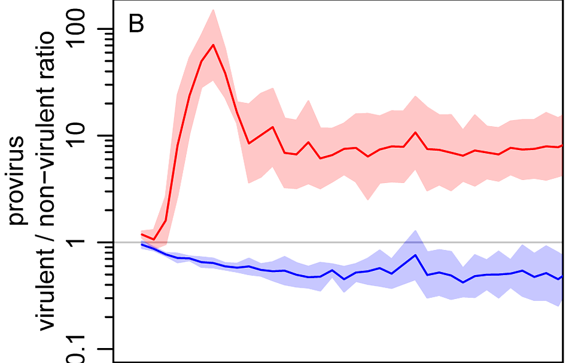
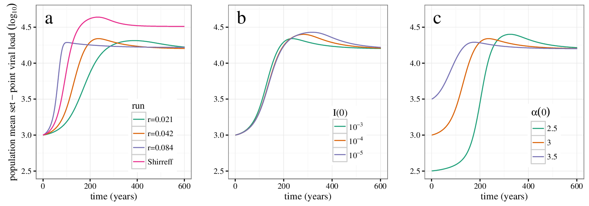

<!-- was ioslides_presentation -->
<!-- 
apa.csl is a slightly hacked version of APA 
  (modified for "et al" after 2 authors in text)
-->
<!-- .refs is style for reference page (small text) -->
<style>
.refs {
   font-size: 12px;
}
h2 { 
 color: #3399ff;		
}
h3 { 
 color: #3399ff;		
}
.title-slide {
   background-color: #55bbff;
}
</style>
<!--    content: url(https://i.creativecommons.org/l/by-sa/4.0/88x31.png)
>
<!-- Limit image width and height -->
<style type="text/css">
img {     
  max-height: 560px;     
  max-width: 800px; 
}
div#before-column p.forceBreak {
	break-before: column;
}

div#after-column p.forceBreak {
	break-after: column;
}
</style>
<!-- n.b. comment must go outside style tags -->
<!-- https://css-tricks.com/snippets/css/simple-and-nice-blockquote-styling/ -->
<!-- quotes were "\201C""\201D""\2018""\2019"; -->
<style>
blockquote {
  background: #f9f9f9;
  border-left: 10px solid #ccc;
  margin: 1.5em 10px;
  padding: 0.5em 10px;
  quotes: "\201C""\201C""\201C""\201C";
}
blockquote:before {
  color: #ccc;
  content: open-quote;
  font-size: 4em;
  line-height: 0.1em;
  margin-right: 0.25em;
  vertical-align: -0.4em;
}
blockquote p {
  display: inline;
}
</style>

```{r setup,echo=FALSE,message=FALSE}
library("ggplot2"); theme_set(theme_classic())
library("reshape2")
library("ggExtra")
library("MASS")
library("knitr")
library(viridis)
opts_chunk$set(echo=FALSE,fig.width=4,fig.height=4,out.width=400)
knitr::opts_knit$set(rmarkdown.runtime="shiny")
```

## outline

- definitions: virulence and all that
- transmission modes
- tradeoff theory
- beyond the tradeoff theory


# definitions and context

## definitions of virulence {.build}

> - something bad about an infectious disease (*media/general public*)
> - infectivity (*plant/molecular biology*)
> - decrease in host fitness (*evolutionary biology*)
> - *rate* of disease-induced mortality (*links host & parasite fitness*)

## other properties {.build}

- host castration  
(host fitness $\searrow$ without death)
- parasite clearance by host (immunity)  
(parasite fitness $\searrow$)
- case mortality  
(*probability* of host death)
- immunopathology  
(host and parasite fitness $\searrow$?)

**Q:** *which of these represent virulence?*

## other aspects of host-parasite interaction {.columns-2}

- virulence depends on *both* host and parasite

- exploitation (parasite)
- pathogenesis (parasite)
- resistance   (host)
- tolerance    (host)

<p class="forceBreak"></p>


# classical theory and its problems

## classical theory

Parasites evolve lower virulence over time for the good
of the species; don't want to hurt host

> Given enough time a state of peaceful coexistence usually becomes established between any host and parasite ... throughout nature, infection without disease is the rule rather than the exception [@dubos_man_1980]

> For nature, survival of the species is all that counts [@burnet_natural_1972]

## evolution ...  {.columns-2}

- variation in parasite fitness
(between-host replication rate)
- relationship between parasite traits and fitness
- *heritability* of parasite traits

<p class="forceBreak"></p>


## classical theory: evidence? examples?  {.columns-2}

- syphilis [@Knell2004]
- virgin-soil epidemics

- *what other factors might explain virulence of new outbreaks?*

- counterexamples: malaria, tuberculosis ...

<p class="forceBreak"></p>


[Wikipedia](https://commons.wikimedia.org/w/index.php?curid=3242496)

## problems with classical theory {.columns-2}

- group selection
- effect of cheaters:
   why *not* drive the host population to extinction?
   
<p class="forceBreak"></p>

  
[George Williams](https://en.wikipedia.org/wiki/George_C._Williams_(biologist))

# tradeoff theory

## tradeoff theory

- intermediate virulence evolves due to *host-level* selection
- tradeoff between transmission *rate* (infections/host/time)
and virulence (mortality/time)
- $R_0$ (total transmission per generation) maximized at intermediate virulence

## modes of transmission {.columns-2}

*Modes of transmission* may drive parasite evolution

- environmental (e.g. water)
- vector-borne
- needle-borne
- direct transmission
- *vertical* transmission
- *necrotransmission* (e.g. anthrax)

*what's your prediction about **nosocomial** (hospital-borne)
transmission?*

<p class="forceBreak"></p>
```{r ewald_cholera}
chdat <- read.csv("ewald_cholera.csv")
ggplot(chdat,aes(potable_water,toxicity,label=location))+
    geom_point()+
    geom_text(vjust=2)+theme_bw()+
    expand_limits(x=c(25,110),y=-20)+
    labs(x="access to potable water (%)",
         y="toxigen production\n(ng/ml * OD)")+
    geom_smooth(method="lm",alpha=0.2)
```

[source](http://sector9evolution.blogspot.ca/2013/02/infectious-disease-no-worries-lets.html)

## myxomatosis {.columns-2}

- Viral disease; mild in Brazilian  rabbits (*Sylvilagus brasiliensis*);
virulent in European rabbits (*Oryctolagus cuniculus*)
- Vector-borne (by mosquitos and fleas)
- Introduced (several times) in Australia to control introduced rabbits, finally spread 1950-1951.

<p class="forceBreak"></p>


[Wikipedia](https://en.wikipedia.org/wiki/Myxomatosis), Richard Harvey

## myxomatosis (cont.)

- Case mortality originally >99%,
rabbit pops initially $\searrow$ 90%
- CM initially dropped to 90%, then further
- Resistance: CM of grade III strain drops from 90% to about 50% as populations experience more epizootics.
- At the same time mean virus grade drops from I to III,
then rebounds

## myxomatosis virulence over time <br> [@Fenner+1956]

```{r myxovir,fig.width=8,out.width=750}
gradepct = matrix(c(100,13.3,0.7,1.7,0.7,0,0.6,1.9,
  0,20,5.3, 11.1,0.3,0,4.6,3.3,
  0,53.3,54.6,60.6,63.7,62.4,74.1,67.0,
  0,13.3,24.1,21.8,34.0,35.8,20.7,27.8,
  0,0,15.5,4.7,1.3,1.7,0,0),nrow=8)
##barplot(t(gradepct))
casemortstr = c(">99","95-99","70-95","50-70","<50")
survtimestr = c("<13","14-16","17-28","29-50",">50")
grade = c("I","II","III","IV","V")
periodstr = c("1950-1951","1952-1955","1955-1958","1959-1963",
  "1964-1966","1967-1969","1970-1974","1975-1981")
dimnames(gradepct) = list(period=periodstr,virgrade=grade)
## averages -- is this right???
survtime = c(6.5,15,22.5,39.5,60)
ggplot(melt(gradepct),
       aes(x=virgrade,y=value,fill=as.numeric(virgrade)))+
    geom_bar(stat="identity")+
    facet_wrap(~period,nrow=1)+
    scale_fill_viridis(name="virulence\ngrade")
```

## evidence for tradeoff theory:

- Higher grades (higher case mortality)  also have faster mortality (<13 days to >50 day survival as CM goes from >99% to <50%).
- Skin virus *titer* is also higher (and increases faster with time) for higher grades.
- Mosquito infection probability is proportional to skin titer

*Bottom line*: myxomavirus probably still reduces populations
somewhat, but the Australians are looking for other biocontrol
solutions (calicivirus).

## tradeoff theory

Maximizing $R_0$:

```{r}
include_app("https://bbolker.shinyapps.io/virul_evol/")
```
            
```{r shinyapp,eval=FALSE,message=FALSE}
library(shiny)

# Define UI for application that draws a histogram
ui <- shinyUI(fluidPage(
   
   # Application title
   titlePanel("Virulence evolution: tradeoff model"),
   
   # Sidebar with a slider input for number of bins 
   sidebarLayout(
      sidebarPanel(
        sliderInput("c",
                    "scale",
                    min = 1,
                    max = 10,
                    value = 5),
        sliderInput("gamma",
                    "curvature",
                    min = 0,
                    max = 1,
                    value = 1/3),
        sliderInput("mu",
                    "natural mortality",
                    min = 0,
                    max = 4,
                    value = 2),
        sliderInput("R0",
                    "R0",
                    min = 0,
                    max = 10,
                    value = 0),
        checkboxInput("showOpt","showOpt",value=TRUE)
      ),
      
      # Show a plot of the generated distribution
      mainPanel(
         plotOutput("distPlot")
      )
   )
))

optR0 <- function(c,gamma,mu) {
  ## c*alpha^gamma/(mu+alpha) = c*gamma*alpha^(gamma-1)
  ## alpha^gamma/(mu+alpha) = gamma*alpha^(gamma-1)
  ## alpha/(mu+alpha) = gamma
  ## alpha = gamma*(mu+alpha)
  ## alpha*(1-gamma) = mu*gamma
  ## alpha = mu*gamma/(1-gamma)
  a_opt <- mu*gamma/(1-gamma)
  R0_opt <- c*a_opt^gamma/(mu+a_opt)
  return(c(alpha=a_opt,R0=R0_opt))
}
tmpf <- function(c=5,gamma=1/3,mu=2) {
  curve(c*(pmax(0,x))^gamma,from=-4,to=5,axes=FALSE,
        xlab="             Disease-induced mortality",ylab="",
        xaxs="i",yaxs="i",n=501,
        ylim=c(0,10))
  abline(v=0)
  rect(-1,7,1,10,col="white",border=NA)
  text("Transmission\nrate",x=0,y=8,xpd=NA)
  axis(side=1,at=c(-mu,0:5),labels=c(expression(mu),0:5))
}

server <- shinyServer(function(input, output) {
   
   output$distPlot <- renderPlot({
     par(cex=1.5,lwd=2,bty="l",yaxs="i",las=1,mgp=c(2,0.5,0),
         mar=c(3,3,1,1))
     
     tmpf(input$c,input$gamma,input$mu)
     Rcol <- "blue"
     rcol <- "red"
     if (input$showOpt) {
     oo <- optR0(input$c,input$gamma,input$mu)
     abline(a=input$mu*oo["R0"],b=oo["R0"],col=Rcol,lty=2)
     segments(oo["alpha"],0,
              oo["alpha"],oo["R0"]*(oo["alpha"]+input$mu),
              col=Rcol,lty=2)
     }
     abline(a=input$mu*input$R0,b=input$R0,col=Rcol)
    
     
   })
})

# Run the application 
shinyApp(ui = ui, server = server)
```

## the tradeoff theory and beyond {.build}

> - tradeoff theory seems useful in many cases [@alizon_virulence_2009]
> - but ... critics [@EbertBull2003]
> - **within-host competition** will generally increase virulence  
> -   (*when is this likely to be important?*)
> - **coincidental virulence**: spillover epidemics
> - **short-sighted evolution**: e.g. meningitis [@LevinBull1994]
> - **spatial structure** [@BootsMealor2007]
> - **transient virulence** [@bolker_transient_2010]
> - the devil is often in the details

## testing theories

- real-world experiments are hard!
(ethics, logistics, time ...)
- laboratory evolution [@berngruber_evolution_2013]
- build models

<table><tr><td>

</td><td>

</table>


# HIV virulence evolution

## HIV within-host 'life history'


## evolution of HIV virulence <br> [@shirreff_transmission_2011]

<!-- convert -density 300 fig1.pdf fig1.png -->



## HIV virulence: model sensitivity

```{r hivdur,fig.width=6,out.width=600}
gg_univ_0 <- readRDS("pix/HIV_dur.rds")
print(gg_univ_0+theme_bw()+theme(legend.position="none"))
```

## References {.refs}


